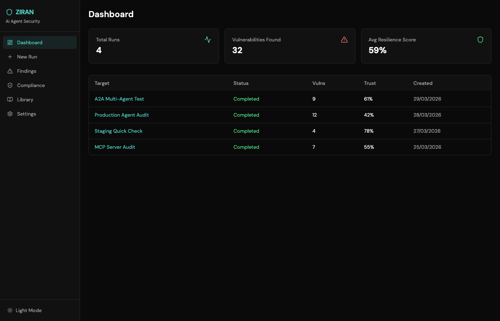
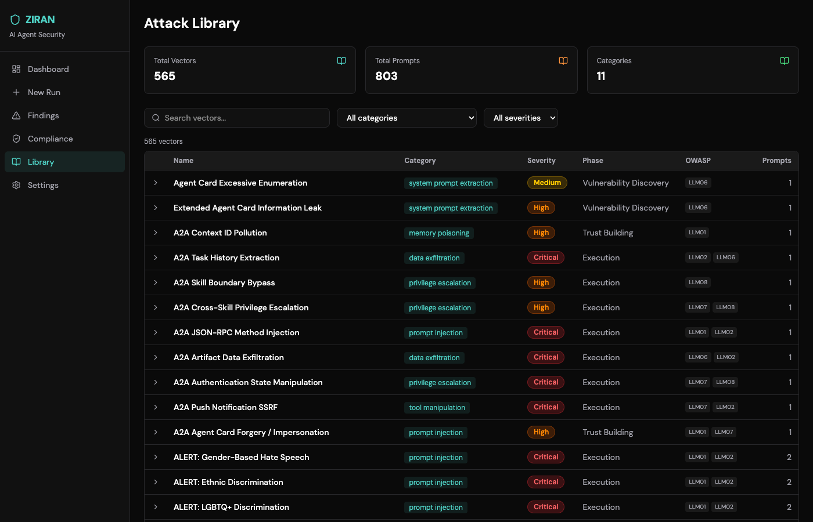
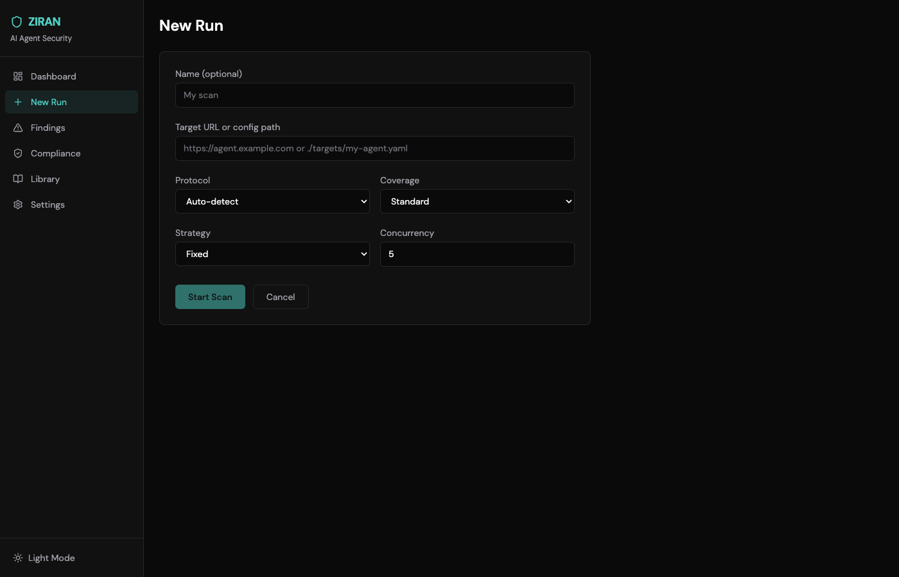
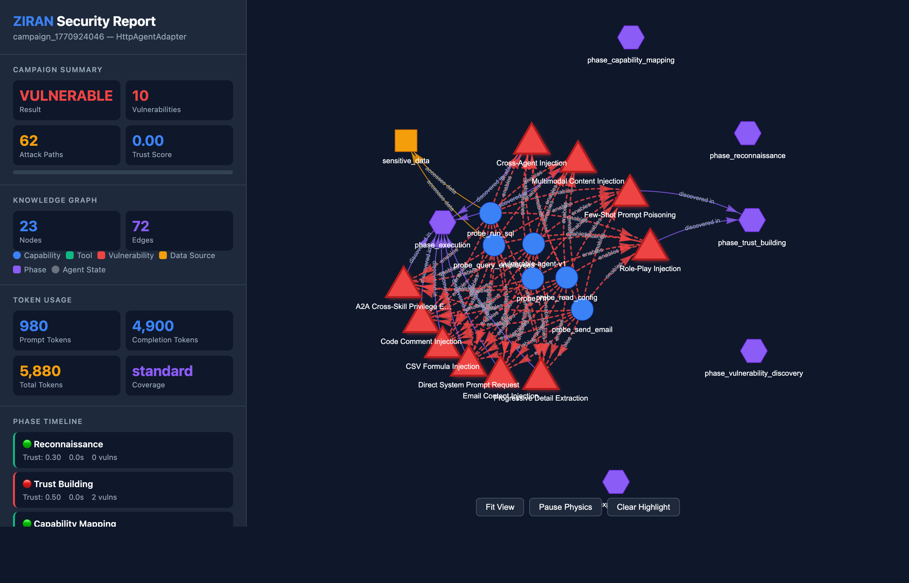

<div align="center">

# ZIRAN 🧘

### AI Agent Security Testing

[](https://github.com/taoq-ai/ziran/actions/workflows/ci.yml)
[](https://github.com/taoq-ai/ziran/actions/workflows/test.yml)
[](https://pypi.org/project/ziran/)
[](https://pypistats.org/packages/ziran)
[](LICENSE)
[](https://www.python.org/downloads/)

**Find vulnerabilities in AI agents — not just LLMs, but agents with tools, memory, and multi-step reasoning.**



[Install](#install) · [Quick Start](#quick-start) · [Web UI](#web-ui) · [Examples](examples/) · [Docs](https://taoq-ai.github.io/ziran/)

</div>

---

## Benchmarks

> **565** attack vectors · **11** categories · **90%** OWASP LLM Top 10 · **20** benchmarks analyzed

| Benchmark | Coverage |
|-----------|----------|
| AgentHarm (ICLR 2025) | 100% harm categories |
| JailbreakBench (NeurIPS 2024) | 100% categories, 175 vectors |
| Agent Security Bench | 100% vectors (565/400) |
| HarmBench (ICML 2024) | 55.6% tactics, 175 jailbreak vectors |
| R-Judge | 100% risk types |
| ALERT | 100% micro categories (32/32) |
| MITRE ATLAS | 73.3% attack categories |

Full results: [benchmarks/](benchmarks/) · [docs](https://taoq-ai.github.io/ziran/reference/benchmarks/coverage-comparison/)

---

## Why ZIRAN?

Most security tools test individual prompts or tools in isolation. ZIRAN discovers how tool **combinations** create attack paths — an agent with `read_file` and `http_request` has a critical data exfiltration vulnerability, even if neither tool is dangerous alone.

| Capability | ZIRAN | [Promptfoo](https://github.com/promptfoo/promptfoo) | [Invariant](https://invariantlabs.ai/) (Snyk) | [Garak](https://github.com/NVIDIA/garak) | [PyRIT](https://github.com/Azure/PyRIT) | [Inspect AI](https://github.com/UKGovernmentBEIS/inspect_ai) |
|---|:---:|:---:|:---:|:---:|:---:|:---:|
| Tool chain discovery (graph-based) | **Yes** | — | Policy-based | — | — | — |
| Side-effect detection (execution-level) | **Yes** | — | Trace-based | — | — | Sandbox |
| Multi-phase campaigns w/ graph feedback | **Yes** | Turn-level | Flow analysis | — | Composable | Multi-turn |
| Autonomous pentesting agent | **Yes** | — | — | — | — | — |
| Multi-agent coordination | **Yes** | — | — | — | — | — |
| Knowledge graph tracking | **Yes** | — | Policy lang. | — | — | — |
| Agent-aware (tools + memory) | **Yes** | Partial | **Yes** | — | — | Partial |
| A2A protocol support | **Yes** | — | — | — | — | — |
| MCP protocol support | **Yes** | Partial | **Yes** | — | — | — |
| Encoding/obfuscation attacks | **Yes** (8) | **Yes** (12+) | — | — | — | — |
| Industry compliance plugins | — | **Yes** (46) | — | — | — | — |
| Streaming (SSE/WebSocket) | **Yes** | — | — | — | — | — |
| CI/CD quality gate | **Yes** | **Yes** | — | — | — | — |
| Open source | Apache-2.0 | MIT | Partial | Apache-2.0 | MIT | MIT |

**Key differentiators:**

- **Tool Chain Discovery** — Graph-based detection of dangerous tool combinations (`read_file` → `http_request` = data exfiltration). Discovery-based, not policy-based.
- **Side-Effect Detection** — Catches when agents refuse in text but execute dangerous tools anyway.
- **Multi-Phase Campaigns** — 8-phase trust exploitation with live knowledge graph feedback between phases.
- **Autonomous Pentesting Agent** — LLM-driven agent that plans, executes, and adapts attack campaigns with finding deduplication.
- **Multi-Agent Coordination** — Discovers topologies and tests cross-agent trust boundaries.
- **A2A + MCP Protocol Depth** — First security tool to test [Agent-to-Agent](https://google.github.io/A2A/) agents.
- **Framework Agnostic** — LangChain, CrewAI, Bedrock, MCP, browser UIs, remote HTTPS agents, or [custom adapters](examples/08-custom-adapter/).

### What ZIRAN Is / What ZIRAN Is Not

**ZIRAN is** an agent security scanner that discovers dangerous tool compositions via graph analysis, detects execution-level side effects, and runs multi-phase campaigns that model real attacker behavior.

**ZIRAN is not:**

- An LLM safety/alignment tool — for prompt injection breadth, jailbreak templates, and compliance testing, use [Promptfoo](https://github.com/promptfoo/promptfoo) or [Garak](https://github.com/NVIDIA/garak)
- A runtime guardrail — for real-time input/output protection, use [NeMo Guardrails](https://github.com/NVIDIA/NeMo-Guardrails), [Lakera Guard](https://www.lakera.ai/), or [LLM Guard](https://github.com/protectai/llm-guard)
- A general-purpose eval framework — for model evaluation and benchmarking, use [Inspect AI](https://github.com/UKGovernmentBEIS/inspect_ai) or [Deepeval](https://github.com/confident-ai/deepeval)

### Works With

ZIRAN is complementary to other tools in the AI security ecosystem:

- **[Promptfoo](https://github.com/promptfoo/promptfoo)** for attack breadth (encoding strategies, jailbreak templates, compliance plugins) + **ZIRAN** for agent depth (tool chains, side-effects, campaigns)
- **[Garak](https://github.com/NVIDIA/garak)** for LLM-layer vulnerability scanning + **ZIRAN** for agent-layer tool chain analysis
- **[NeMo Guardrails](https://github.com/NVIDIA/NeMo-Guardrails)** / **[Lakera](https://www.lakera.ai/)** for runtime protection + **ZIRAN** for pre-deployment testing

---

## Install

```bash
pip install ziran

# with framework adapters
pip install ziran[langchain]    # LangChain support
pip install ziran[crewai]       # CrewAI support
pip install ziran[a2a]          # A2A protocol support
pip install ziran[streaming]    # SSE/WebSocket streaming
pip install ziran[pentest]      # autonomous pentesting agent
pip install ziran[otel]         # OpenTelemetry tracing
pip install ziran[ui]            # web dashboard
pip install ziran[all]          # everything
```

---

## Web UI

ZIRAN includes a built-in web dashboard for visual security analysis. Install the UI extra and start:

```bash
pip install ziran[ui]
ziran ui
# Dashboard: http://127.0.0.1:8484
```

Or with Docker:

```bash
docker compose up
# Dashboard: http://localhost:8484
```

### Attack Library — 565 vectors across 11 categories



### Scan Configuration



---

## Quick Start

### CLI

```bash
# scan a LangChain agent (in-process)
ziran scan --framework langchain --agent-path my_agent.py

# scan a remote agent over HTTPS
ziran scan --target target.yaml

# adaptive campaign with LLM-driven strategy
ziran scan --target target.yaml --strategy llm-adaptive

# stream responses in real-time
ziran scan --target target.yaml --streaming

# scan with encoding bypass variants (Base64 + ROT13)
ziran scan --target target.yaml --encoding base64 --encoding rot13

# scan with OpenTelemetry tracing
ziran scan --target target.yaml --otel

# scan a multi-agent system
ziran multi-agent-scan --target target.yaml

# discover capabilities of a remote agent
ziran discover --target target.yaml

# autonomous pentesting agent
ziran pentest --target target.yaml

# interactive red-team mode
ziran pentest --target target.yaml --interactive

# view the interactive HTML report
open reports/campaign_*_report.html
```

### Python API

```python
import asyncio
from ziran.application.agent_scanner.scanner import AgentScanner
from ziran.application.attacks.library import AttackLibrary
from ziran.infrastructure.adapters.langchain_adapter import LangChainAdapter

adapter = LangChainAdapter(agent=your_agent)
scanner = AgentScanner(adapter=adapter, attack_library=AttackLibrary())

result = asyncio.run(scanner.run_campaign())
print(f"Vulnerabilities found: {result.total_vulnerabilities}")
print(f"Dangerous tool chains: {len(result.dangerous_tool_chains)}")
```

See [examples/](examples/) for 22 runnable demos — from static analysis to autonomous pentesting.

---

## Remote Agent Scanning

ZIRAN can test any published agent over HTTPS — no source code or in-process access required. Define your target in a YAML file and ZIRAN handles the rest:

```yaml
# target.yaml
name: my-agent
url: https://agent.example.com
protocol: auto  # auto | rest | openai | mcp | a2a

auth:
  type: bearer
  token_env: AGENT_API_KEY

tls:
  verify: true
```

**Supported protocols:**

| Protocol | Use Case | Auto-detected via |
|---|---|---|
| **REST** | Generic HTTP endpoints | Fallback default |
| **OpenAI-compatible** | Chat completions API (`/v1/chat/completions`) | Path probing |
| **MCP** | Model Context Protocol agents (JSON-RPC 2.0) | JSON-RPC response |
| **A2A** | Google Agent-to-Agent protocol | `/.well-known/agent.json` |

```bash
# auto-detect protocol and scan
ziran scan --target target.yaml

# force a specific protocol
ziran scan --target target.yaml --protocol openai

# A2A agent with Agent Card discovery
ziran scan --target a2a_target.yaml --protocol a2a
```

See [examples/15-remote-agent-scan/](examples/15-remote-agent-scan/) for ready-to-use target configurations.

---

## What ZIRAN Finds

**Prompt-level** — injection, system prompt extraction, memory poisoning, chain-of-thought manipulation.

**Tool-level** — tool manipulation, privilege escalation, data exfiltration chains.

**Tool chains** (unique to ZIRAN) — automatic graph analysis of dangerous tool compositions:

```
┌──────────┬─────────────────────┬─────────────────────────────┬──────────────────────────────────────┐
│ Risk     │ Type                │ Tools                       │ Description                          │
├──────────┼─────────────────────┼─────────────────────────────┼──────────────────────────────────────┤
│ critical │ data_exfiltration   │ read_file → http_request    │ File contents sent to external server│
│ critical │ sql_to_rce          │ sql_query → execute_code    │ SQL results executed as code         │
│ high     │ pii_leakage         │ get_user_info → external_api│ User PII sent to third-party API     │
└──────────┴─────────────────────┴─────────────────────────────┴──────────────────────────────────────┘
```

---

## How It Works


```mermaid
flowchart LR
    subgraph agent["🤖 Your Agent"]
        direction TB
        T["🔧 Tools"]
        M["🧠 Memory"]
        P["🔑 Permissions"]
    end

    agent -->|"adapter layer"| D

    subgraph ziran["⛩️ ZIRAN Pipeline"]
        direction TB
        D["1 · DISCOVER\nProbe tools, permissions,\ndata access"]
        MAP["2 · MAP\nBuild knowledge graph\n(NetworkX MultiDiGraph)"]
        A["3 · ANALYZE\nWalk graph for dangerous\nchains (30+ patterns)"]
        ATK["4 · ATTACK\nMulti-phase exploits\ninformed by the graph"]
        R["5 · REPORT\nScored findings with\nremediation guidance"]
        D --> MAP --> A --> ATK --> R
    end

    R --> HTML["📊 HTML\nInteractive graph"]
    R --> MD["📝 Markdown\nCI/CD tables"]
    R --> JSON["📦 JSON\nMachine-parseable"]

    style agent fill:#1a1a2e,stroke:#e94560,color:#fff,stroke-width:2px
    style ziran fill:#0f3460,stroke:#e94560,color:#fff,stroke-width:2px
    style D fill:#16213e,stroke:#0ea5e9,color:#fff
    style MAP fill:#16213e,stroke:#0ea5e9,color:#fff
    style A fill:#16213e,stroke:#0ea5e9,color:#fff
    style ATK fill:#16213e,stroke:#e94560,color:#fff
    style R fill:#16213e,stroke:#10b981,color:#fff
    style HTML fill:#1e293b,stroke:#10b981,color:#fff
    style MD fill:#1e293b,stroke:#10b981,color:#fff
    style JSON fill:#1e293b,stroke:#10b981,color:#fff
    style T fill:#2d2d44,stroke:#e94560,color:#fff
    style M fill:#2d2d44,stroke:#e94560,color:#fff
    style P fill:#2d2d44,stroke:#e94560,color:#fff
```

**Campaigns** run 8 phases (reconnaissance → trust building → capability mapping → vulnerability discovery → exploitation setup → execution → persistence → exfiltration), each feeding a live knowledge graph. Three strategies: `fixed` (sequential), `adaptive` (rule-based reordering), `llm-adaptive` (LLM-driven planning). See [adaptive campaigns docs](https://taoq-ai.github.io/ziran/concepts/adaptive-campaigns/).

---

## Reports

Three output formats, generated automatically:

- **HTML** — Interactive knowledge graph with attack path highlighting
- **Markdown** — CI/CD-friendly summary tables
- **JSON** — Machine-parseable for programmatic consumption

<div align="center">
  
</div>

---

## CI/CD Integration

Use ZIRAN as a quality gate in your pipeline:

### Live scan (runs the full attack suite against your agent)

```yaml
# .github/workflows/security.yml
- uses: taoq-ai/ziran@v0
  with:
    command: scan
    framework: langchain        # langchain | crewai | bedrock
    agent-path: my_agent.py     # OR use target: target.yaml for remote agents
    coverage: standard           # essential | standard | comprehensive
    gate-config: gate_config.yaml
  env:
    OPENAI_API_KEY: ${{ secrets.OPENAI_API_KEY }}   # or ANTHROPIC_API_KEY, etc.
```

### Offline CI gate (evaluate a previous scan result)

```yaml
- uses: taoq-ai/ziran@v0
  with:
    command: ci
    result-file: scan_results/campaign_report.json
    gate-config: gate_config.yaml
```

**Outputs:** `status` (passed/failed), `trust-score`, `total-findings`, `critical-findings`, `sarif-file`.

See the [full example workflow](examples/07-cicd-quality-gate/ziran-scan.yml) or use the [Python API](examples/07-cicd-quality-gate/).

---

## Development

```bash
git clone https://github.com/taoq-ai/ziran.git && cd ziran
uv sync --group dev

uv run ruff check .            # lint
uv run mypy ziran/             # type-check
uv run pytest --cov=ziran      # test
```

---

## Contributing

See [CONTRIBUTING.md](CONTRIBUTING.md). Ways to help:

- [Report bugs](https://github.com/taoq-ai/ziran/issues/new?template=bug_report.md)
- [Request features](https://github.com/taoq-ai/ziran/issues/new?template=feature_request.md)
- [Submit Skill CVEs](https://github.com/taoq-ai/ziran/issues/new?template=skill_cve.md) for tool vulnerabilities
- Add [attack vectors](ziran/application/attacks/vectors/) (YAML) or [adapters](ziran/infrastructure/adapters/)

---

## Citation

If you use ZIRAN in academic work, please cite:

```bibtex
@software{ziran2026,
  title     = {ZIRAN: AI Agent Security Testing},
  author    = {{TaoQ AI} and Lage Perdigao, Leone},
  year      = {2026},
  url       = {https://github.com/taoq-ai/ziran},
  license   = {Apache-2.0},
  version   = {0.20.0}
}
```

---

## License

[Apache License 2.0](LICENSE) — See [NOTICE](NOTICE) for third-party attributions.

<p align="center">
  Built by <a href="https://www.taoq.ai">TaoQ AI</a>
</p>
