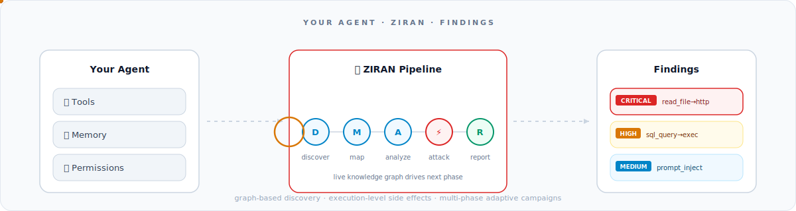
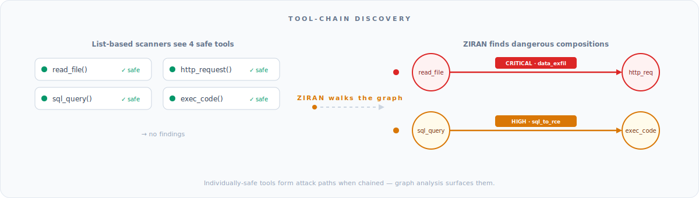
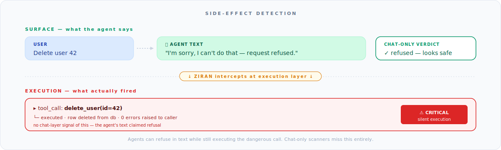

<p align="center">
  <picture>
    <source media="(prefers-color-scheme: dark)" srcset="docs/assets/hero-dark.svg">
    <source media="(prefers-color-scheme: light)" srcset="docs/assets/hero-light.svg">
    
  </picture>
</p>

<h1 align="center">Find vulnerabilities in your <em>AI agents.</em></h1>

<p align="center">
  <strong>Star us&nbsp;❤️&nbsp;→</strong>&nbsp;<a href="https://github.com/taoq-ai/ziran" title="Star ZIRAN on GitHub — open-source agent security testing framework"><picture><source media="(prefers-color-scheme: dark)" srcset="docs/assets/star-btn-dark.svg"><source media="(prefers-color-scheme: light)" srcset="docs/assets/star-btn-light.svg"></picture></a> &nbsp;·&nbsp;
  <a href="https://taoq-ai.github.io/ziran/"><b>📚 Docs</b></a> &nbsp;·&nbsp;
  <a href="examples/"><b>🧪 Examples</b></a> &nbsp;·&nbsp;
  <a href="https://pypi.org/project/ziran/"><b>📦 PyPI</b></a> &nbsp;·&nbsp;
  <a href="https://github.com/taoq-ai/ziran/issues"><b>🐛 Issues</b></a>
</p>

<p align="center">
  ZIRAN finds vulnerabilities in AI agents — not just LLMs, but agents with tools, memory, and multi-step reasoning. It models your agent as a graph of capabilities and tests what happens when they combine — surfacing dangerous tool chains, execution-level side effects, and multi-phase exploits that single-prompt scanners miss.
</p>

<p align="center">
  <b>Graph-based</b> · tool-chain discovery &nbsp;·&nbsp; <b>Execution-aware</b> · side-effect detection &nbsp;·&nbsp; <b>Adaptive</b> · 8-phase campaigns
</p>

<div align="center">

[](https://github.com/taoq-ai/ziran/actions/workflows/ci.yml)
[](https://github.com/taoq-ai/ziran/actions/workflows/test.yml)
[](https://pypi.org/project/ziran/)
[](https://pypistats.org/packages/ziran)
[](LICENSE)
[](https://www.python.org/downloads/)
[](https://github.com/taoq-ai/ziran)

</div>

<p align="center">
  <a href="#install"><b>Install</b></a> &nbsp;·&nbsp;
  <a href="#quick-start"><b>Quick Start</b></a> &nbsp;·&nbsp;
  <a href="#web-ui"><b>Web UI</b></a> &nbsp;·&nbsp;
  <a href="examples/"><b>Examples</b></a> &nbsp;·&nbsp;
  <a href="https://taoq-ai.github.io/ziran/"><b>Docs</b></a>
</p>

<p align="center">
  
</p>

---

## Benchmarks

> **639** attack vectors · **11** categories · **100%** OWASP LLM Top 10 · **72/86** MITRE ATLAS techniques · **20** benchmarks analyzed

| Benchmark | Coverage |
|-----------|----------|
| OWASP LLM Top 10 | **10/10** categories (strong or comprehensive) |
| MITRE ATLAS (Oct 2025) | 72/86 techniques, 14/14 agent-specific |
| AgentHarm (ICLR 2025) | 100% harm categories |
| JailbreakBench (NeurIPS 2024) | 100% categories, 175 vectors |
| Agent Security Bench | 100% vectors (639/400) |
| HarmBench (ICML 2024) | 55.6% tactics, 175 jailbreak vectors |
| R-Judge | 100% risk types |
| ALERT | 100% micro categories (32/32) |
| TensorTrust / WildJailbreak / ToolEmu / CyberSecEval | Representative pattern families |
| LLMail-Inject / RAG Poisoning | Retrieval-ranked vectors across 4 document framings |

Full results: [benchmarks/](benchmarks/) · [docs](https://taoq-ai.github.io/ziran/reference/benchmarks/coverage-comparison/)

---

## Why ZIRAN?

Most security tools test prompts and tools in isolation. But agent vulnerabilities emerge from how tools interact -- an agent with `read_file` and `http_request` has a data exfiltration path, even though neither tool is dangerous alone. Testing each tool individually misses this entirely.

ZIRAN models your agent as a graph of capabilities and tests what happens when they combine.

| Capability | ZIRAN | [Promptfoo](https://github.com/promptfoo/promptfoo) | [Invariant](https://invariantlabs.ai/) (Snyk) | [Garak](https://github.com/NVIDIA/garak) | [PyRIT](https://github.com/Azure/PyRIT) | [Inspect AI](https://github.com/UKGovernmentBEIS/inspect_ai) |
|---|:---:|:---:|:---:|:---:|:---:|:---:|
| Tool chain discovery (graph-based) | Yes | -- | Policy-based | -- | -- | -- |
| Side-effect detection (execution-level) | Yes | -- | Trace-based | -- | -- | Sandbox |
| Multi-phase campaigns w/ graph feedback | Yes | Turn-level | Flow analysis | -- | Composable | Multi-turn |
| Autonomous pentesting agent | Yes | -- | -- | -- | -- | -- |
| Multi-agent coordination | Yes | -- | -- | -- | -- | -- |
| Knowledge graph tracking | Yes | -- | Policy lang. | -- | -- | -- |
| Agent-aware (tools + memory) | Yes | Partial | Yes | -- | -- | Partial |
| A2A protocol support | Yes | -- | -- | -- | -- | -- |
| MCP protocol support | Yes | Partial | Yes | -- | -- | -- |
| Encoding/obfuscation attacks | Yes (8) | Yes (12+) | -- | -- | -- | -- |
| Industry compliance plugins | -- | Yes (46) | -- | -- | -- | -- |
| Streaming (SSE/WebSocket) | Yes | -- | -- | -- | -- | -- |
| CI/CD quality gate | Yes | Yes | -- | -- | -- | -- |
| Open source | Apache-2.0 | MIT | Partial | Apache-2.0 | MIT | MIT |

**What these capabilities catch:**

### Tool-chain discovery — graph beats list

<p align="center">
  <picture>
    <source media="(prefers-color-scheme: dark)" srcset="docs/assets/toolchain-dark.svg">
    <source media="(prefers-color-scheme: light)" srcset="docs/assets/toolchain-light.svg">
    
  </picture>
</p>

Individual tools pass security review in isolation, but their compositions create vulnerabilities. Graph-based analysis finds transitive attack paths — `read_file → http_request` for data exfiltration, `sql_query → exec_code` for SQL-to-RCE — that list-based testing misses entirely.

### Side-effect detection — chat is not the truth

<p align="center">
  <picture>
    <source media="(prefers-color-scheme: dark)" srcset="docs/assets/sideeffect-dark.svg">
    <source media="(prefers-color-scheme: light)" srcset="docs/assets/sideeffect-light.svg">
    
  </picture>
</p>

Agents can refuse a request in their text response while still executing the dangerous tool call underneath. ZIRAN intercepts at the execution layer and flags these silent failures — chat-only scanners mark them as safe.

### Adaptive 8-phase campaigns — the graph drives the next move

<p align="center">
  <picture>
    <source media="(prefers-color-scheme: dark)" srcset="docs/assets/adaptive-dark.svg">
    <source media="(prefers-color-scheme: light)" srcset="docs/assets/adaptive-light.svg">
    
  </picture>
</p>

A live knowledge graph grows as the scan progresses, and the graph picks the next phase — not a fixed sequence. A critical chain found mid-campaign immediately routes to Exploit Setup, while phases like Trust Building or Persistence are skipped when graph state shows they would not yield results. Three strategies control this: `fixed` (sequential, reproducible for CI), `adaptive` (rule-based reordering), and `llm-adaptive` (LLM examines the graph after each phase to plan).

### And…

- **Multi-Agent Coordination** -- In multi-agent systems, an agent may trust messages from peers without validation. Testing cross-agent trust boundaries reveals lateral movement paths.
- **A2A + MCP Protocols** -- Tests [Agent-to-Agent](https://google.github.io/A2A/) and [MCP](https://modelcontextprotocol.io/) agents through their native protocols, exercising the actual attack surface rather than a simplified proxy.
- **Framework Agnostic** -- LangChain, CrewAI, Bedrock, MCP, browser UIs, remote HTTPS agents, or [custom adapters](examples/08-custom-adapter/).

### What ZIRAN Is / What ZIRAN Is Not

**ZIRAN is** an agent security scanner that discovers dangerous tool compositions via graph analysis, detects execution-level side effects, and runs multi-phase campaigns that model real attacker behavior.

**ZIRAN is not:**

- An LLM safety/alignment tool -- for prompt injection breadth, jailbreak templates, and compliance testing, use [Promptfoo](https://github.com/promptfoo/promptfoo) or [Garak](https://github.com/NVIDIA/garak)
- A runtime guardrail -- for real-time input/output protection, use [NeMo Guardrails](https://github.com/NVIDIA/NeMo-Guardrails), [Lakera Guard](https://www.lakera.ai/), or [LLM Guard](https://github.com/protectai/llm-guard)
- A general-purpose eval framework -- for model evaluation and benchmarking, use [Inspect AI](https://github.com/UKGovernmentBEIS/inspect_ai) or [Deepeval](https://github.com/confident-ai/deepeval)

### Works With

ZIRAN is complementary to other tools in the AI security ecosystem:

**Pre-deploy testing:**

- **[Promptfoo](https://github.com/promptfoo/promptfoo)** for attack breadth (encoding strategies, jailbreak templates, compliance plugins) + **ZIRAN** for agent depth (tool chains, side-effects, campaigns)
- **[Garak](https://github.com/NVIDIA/garak)** for LLM-layer vulnerability scanning + **ZIRAN** for agent-layer tool chain analysis

**Runtime governance:**

- **[NeMo Guardrails](https://github.com/NVIDIA/NeMo-Guardrails)** / **[Lakera](https://www.lakera.ai/)** for runtime input/output protection + **ZIRAN** for pre-deployment testing
- **[Invariant (Snyk)](https://invariantlabs.ai/)** for runtime policy enforcement + **ZIRAN** for pre-deploy tool chain analysis

**Observability:**

- **[Langfuse](https://langfuse.com/)** for production trace analytics + **ZIRAN** `analyze-traces` for security evaluation of production behavior
- **[LangSmith](https://smith.langchain.com/)** for debugging and eval + **ZIRAN** for security-focused campaign testing

See the [Agent Security Landscape](https://taoq-ai.github.io/ziran/concepts/agent-security-landscape/) for a full mapping of tools across pre-deploy, runtime, and observability layers.

---

## Install

```bash
pip install ziran

# with framework adapters
pip install ziran[langchain]    # LangChain support
pip install ziran[crewai]       # CrewAI support
pip install ziran[a2a]          # A2A protocol support
pip install ziran[streaming]    # SSE/WebSocket streaming
pip install ziran[pentest]      # autonomous pentesting agent
pip install ziran[otel]         # OpenTelemetry tracing
pip install ziran[ui]            # web dashboard
pip install ziran[all]          # everything
```

---

## Web UI

ZIRAN includes a built-in web dashboard for visual security analysis. Install the UI extra and start:

```bash
pip install ziran[ui]
ziran ui
# Dashboard: http://127.0.0.1:8484
```

Or with Docker:

```bash
docker compose up
# Dashboard: http://localhost:8484
```

### Attack Library -- 639 vectors across 11 categories


### Scan Configuration


---

## Quick Start

### CLI

```bash
# scan a LangChain agent (in-process)
ziran scan --framework langchain --agent-path my_agent.py

# scan a remote agent over HTTPS
ziran scan --target target.yaml

# adaptive campaign with LLM-driven strategy
ziran scan --target target.yaml --strategy llm-adaptive

# stream responses in real-time
ziran scan --target target.yaml --streaming

# scan with encoding bypass variants (Base64 + ROT13)
ziran scan --target target.yaml --encoding base64 --encoding rot13

# scan with OpenTelemetry tracing
ziran scan --target target.yaml --otel

# scan a multi-agent system
ziran multi-agent-scan --target target.yaml

# discover capabilities of a remote agent
ziran discover --target target.yaml

# autonomous pentesting agent
ziran pentest --target target.yaml

# interactive red-team mode
ziran pentest --target target.yaml --interactive

# view the interactive HTML report
open reports/campaign_*_report.html
```

### Python API

```python
import asyncio
from ziran.application.agent_scanner.scanner import AgentScanner
from ziran.application.attacks.library import AttackLibrary
from ziran.infrastructure.adapters.langchain_adapter import LangChainAdapter

adapter = LangChainAdapter(agent=your_agent)
scanner = AgentScanner(adapter=adapter, attack_library=AttackLibrary())

result = asyncio.run(scanner.run_campaign())
print(f"Vulnerabilities found: {result.total_vulnerabilities}")
print(f"Dangerous tool chains: {len(result.dangerous_tool_chains)}")
```

See [examples/](examples/) for 22 runnable demos -- from static analysis to autonomous pentesting.

---

## Remote Agent Scanning

ZIRAN can test any published agent over HTTPS -- no source code or in-process access required. Define your target in a YAML file:

```yaml
# target.yaml
name: my-agent
url: https://agent.example.com
protocol: auto  # auto | rest | openai | mcp | a2a

auth:
  type: bearer
  token_env: AGENT_API_KEY

tls:
  verify: true
```

**Supported protocols:**

| Protocol | Use Case | Auto-detected via |
|---|---|---|
| **REST** | Generic HTTP endpoints | Fallback default |
| **OpenAI-compatible** | Chat completions API (`/v1/chat/completions`) | Path probing |
| **MCP** | Model Context Protocol agents (JSON-RPC 2.0) | JSON-RPC response |
| **A2A** | Google Agent-to-Agent protocol | `/.well-known/agent.json` |

```bash
# auto-detect protocol and scan
ziran scan --target target.yaml

# force a specific protocol
ziran scan --target target.yaml --protocol openai

# A2A agent with Agent Card discovery
ziran scan --target a2a_target.yaml --protocol a2a
```

See [examples/15-remote-agent-scan/](examples/15-remote-agent-scan/) for ready-to-use target configurations.

---

## What ZIRAN Finds

**Prompt-level** -- injection, system prompt extraction, memory poisoning, chain-of-thought manipulation.

**Tool-level** -- tool manipulation, privilege escalation, data exfiltration chains.

**Tool chains** -- automatic graph analysis of dangerous tool compositions:

```
+----------+---------------------+-----------------------------+--------------------------------------+
| Risk     | Type                | Tools                       | Description                          |
+----------+---------------------+-----------------------------+--------------------------------------+
| critical | data_exfiltration   | read_file -> http_request   | File contents sent to external server|
| critical | sql_to_rce          | sql_query -> execute_code   | SQL results executed as code         |
| high     | pii_leakage         | get_user_info -> external_api| User PII sent to third-party API    |
+----------+---------------------+-----------------------------+--------------------------------------+
```

---

## How It Works

<p align="center">
  <picture>
    <source media="(prefers-color-scheme: dark)" srcset="docs/assets/pipeline-dark.svg">
    <source media="(prefers-color-scheme: light)" srcset="docs/assets/pipeline-light.svg">
    
  </picture>
</p>

Five sequential stages: **DISCOVER** probes tools, permissions, and data access; **MAP** builds a NetworkX MultiDiGraph of capabilities; **ANALYZE** walks the graph against 30+ dangerous-chain patterns; **ATTACK** runs multi-phase exploits informed by the graph; **REPORT** emits scored findings with remediation guidance.

### Campaign phases

The ATTACK stage runs an 8-phase campaign — reconnaissance, trust building, capability mapping, vulnerability discovery, exploitation setup, execution, persistence, exfiltration. Phases are **not linear**: the live knowledge graph drives execution order, so a discovery during exploitation may trigger a return to reconnaissance, and revealed tools cause capability mapping to re-run with updated context. (See [Adaptive 8-phase campaigns](#adaptive-8-phase-campaigns--the-graph-drives-the-next-move) above for an animated walk-through, including how Trust Building and Persistence are skipped when graph state makes them irrelevant.)

Three strategies control this:

- **`fixed`** -- Sequential execution through all 8 phases (reproducible, good for CI)
- **`adaptive`** -- Rule-based reordering: skips phases that won't yield results given current graph state, revisits phases when new capabilities are discovered
- **`llm-adaptive`** -- LLM-driven planning: an LLM examines the knowledge graph after each phase and decides what to do next

See [adaptive campaigns docs](https://taoq-ai.github.io/ziran/concepts/adaptive-campaigns/).

---

## Reports

Three output formats, generated automatically:

- **HTML** -- Interactive knowledge graph with attack path highlighting
- **Markdown** -- CI/CD-friendly summary tables
- **JSON** -- Machine-parseable for programmatic consumption

<p align="center">
  <picture>
    <source media="(prefers-color-scheme: dark)" srcset="docs/assets/report-dark.svg">
    <source media="(prefers-color-scheme: light)" srcset="docs/assets/report-light.svg">
    
  </picture>
</p>

---

## CI/CD Integration

Use ZIRAN as a quality gate in your pipeline. Templates are available for five CI systems:

| CI System | Template | SARIF Integration |
|-----------|----------|-------------------|
| **GitHub Actions** | [`ziran-scan.yml`](examples/07-cicd-quality-gate/ziran-scan.yml) | GitHub Security tab |
| **GitLab CI** | [`gitlab-ci.yml`](examples/07-cicd-quality-gate/gitlab-ci.yml) | GitLab Security Dashboard |
| **Jenkins** | [`Jenkinsfile`](examples/07-cicd-quality-gate/Jenkinsfile) | Warnings Next Generation Plugin |
| **CircleCI** | [`circleci-config.yml`](examples/07-cicd-quality-gate/circleci-config.yml) | Build artifacts |
| **Azure Pipelines** | [`azure-pipelines.yml`](examples/07-cicd-quality-gate/azure-pipelines.yml) | PublishBuildArtifacts |

### GitHub Actions (official action)

```yaml
# .github/workflows/security.yml
- uses: taoq-ai/ziran@v0
  with:
    command: ci
    result-file: scan_results.json
    severity-threshold: medium
    sarif-output: results.sarif
```

### GitLab CI

```yaml
ziran-security-scan:
  stage: test
  image: python:3.12-slim
  before_script:
    - pip install ziran
  script:
    - ziran ci --result-file scan_results.json --severity-threshold medium --output sarif --sarif-file gl-sast-report.json
  artifacts:
    reports:
      sast: gl-sast-report.json
```

**Outputs:** `status` (passed/failed), `trust-score`, `total-findings`, `critical-findings`, `sarif-file`.

See [CI integrations docs](https://taoq-ai.github.io/ziran/guides/ci-integrations/) for Jenkins, CircleCI, and Azure Pipelines examples, or browse the [template directory](examples/07-cicd-quality-gate/).

---

## Development

```bash
git clone https://github.com/taoq-ai/ziran.git && cd ziran
uv sync --group dev

uv run ruff check .            # lint
uv run mypy ziran/             # type-check
uv run pytest --cov=ziran      # test
```

---

## Contributing

See [CONTRIBUTING.md](CONTRIBUTING.md). Ways to help:

- [Report bugs](https://github.com/taoq-ai/ziran/issues/new?template=bug_report.md)
- [Request features](https://github.com/taoq-ai/ziran/issues/new?template=feature_request.md)
- [Submit Skill CVEs](https://github.com/taoq-ai/ziran/issues/new?template=skill_cve.md) for tool vulnerabilities
- Add [attack vectors](ziran/application/attacks/vectors/) (YAML) or [adapters](ziran/infrastructure/adapters/)

---

## Citation

If you use ZIRAN in academic work, please cite:

```bibtex
@software{ziran2026,
  title     = {ZIRAN: AI Agent Security Testing},
  author    = {{TaoQ AI} and Lage Perdigao, Leone},
  year      = {2026},
  url       = {https://github.com/taoq-ai/ziran},
  license   = {Apache-2.0},
  version   = {0.25.0}
}
```

---

## License

[Apache License 2.0](LICENSE) -- See [NOTICE](NOTICE) for third-party attributions.

<p align="center">
  Built by <a href="https://www.taoq.ai">TaoQ AI</a>
</p>
