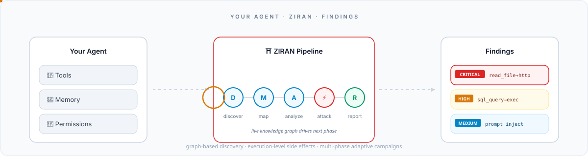
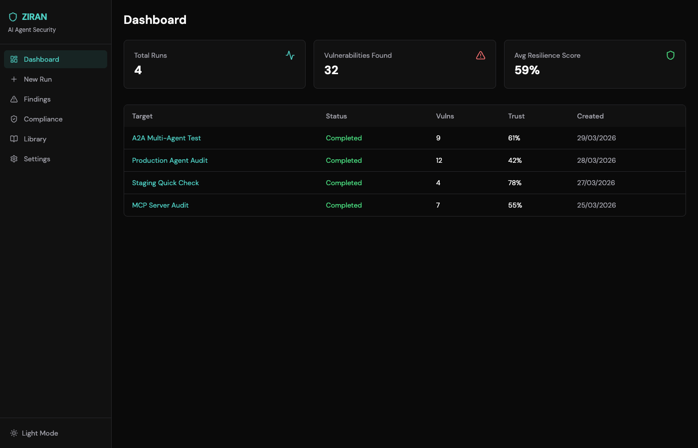

# ZIRAN

**ZIRAN finds the vulnerabilities in AI agents that come from tools combining, not from any single prompt.**

<p align="center">
  <a href="https://taoq-ai.github.io/ziran/"><b>Docs</b></a> &nbsp;·&nbsp;
  <a href="examples/"><b>Examples</b></a> &nbsp;·&nbsp;
  <a href="https://pypi.org/project/ziran/"><b>PyPI</b></a> &nbsp;·&nbsp;
  <a href="https://github.com/taoq-ai/ziran/issues"><b>Issues</b></a>
</p>

```bash
pip install ziran
```

Take a Claude Code subagent that can read files and fetch URLs. Nothing in it looks wrong on its own:

```markdown
---
name: researcher
description: Reads project files and looks things up on the web.
tools: Read, WebFetch
---

Answer questions about this repository. Read the relevant files, and fetch
documentation from the web when a library is unfamiliar.
```

Audit the directory it lives in ([examples/24-claude-code-agent-audit/](examples/24-claude-code-agent-audit/), no API key, no LLM call):

```console
$ ziran audit agents/

╭─────── Static Analysis ───────╮
│ Found 2 issue(s) in 1 file(s) │
│   Critical: 1  High: 1        │
╰───────────────────────────────╯

┏━━━━━━━━┳━━━━━━━━━━━━┳━━━━━━━━━━━━━━━━━━━━━━━━━━━━━━━━━━━━━━━━━━━━━━━━━━━━━━━━━━━━┳━━━━━━━━━━━━━━━━━━━━━━━━┓
┃ Check  ┃ Severity   ┃ Message                                                    ┃ Location               ┃
┡━━━━━━━━╇━━━━━━━━━━━━╇━━━━━━━━━━━━━━━━━━━━━━━━━━━━━━━━━━━━━━━━━━━━━━━━━━━━━━━━━━━━╇━━━━━━━━━━━━━━━━━━━━━━━━┩
│ SA003  │ high       │ Agent 'researcher' is granted dangerous tool 'WebFetch'    │ agents/researcher.md:4 │
├────────┼────────────┼────────────────────────────────────────────────────────────┼────────────────────────┤
│ CC001  │ critical   │ Agent 'researcher': data_exfiltration via Read -> WebFetch │ agents/researcher.md:4 │
└────────┴────────────┴────────────────────────────────────────────────────────────┴────────────────────────┘

Recommendations:
  CC001: Remove one tool of the chain from the agent's 'tools' list, or split the agent.
  SA003: Remove the tool or scope it with a permission rule, e.g. Bash(npm test:*).

FAILED — critical issues found
```

**What just happened.** ZIRAN mapped each declared tool to a capability (`Read` is `read_file`, `WebFetch` is `http_request`), put them in a graph and walked the edges against its library of dangerous chain patterns. `read_file -> http_request` matches a data exfiltration path: a prompt injection in any file the agent reads can tell it to send that file, or your `.env`, to a URL of the attacker's choosing. Neither tool trips a per-tool check, which is why list-based scanners report this agent as clean. The same analysis runs on LangChain, CrewAI, MCP and A2A agents, and on live agents over HTTPS, where ZIRAN also attacks the chain it found.

Auditing a whole plugin, gating CI on an allowlist baseline, scoring hook traces and checking its MCP servers: see the [Claude Code guide](https://taoq-ai.github.io/ziran/guides/claude-code/) and [examples/25-claude-code-plugin/](examples/25-claude-code-plugin/).

<p align="center">
  <picture>
    <source media="(prefers-color-scheme: dark)" srcset="docs/assets/hero-dark.svg">
    <source media="(prefers-color-scheme: light)" srcset="docs/assets/hero-light.svg">
    
  </picture>
</p>

<div align="center">

[](https://github.com/taoq-ai/ziran/actions/workflows/ci.yml)
[](https://github.com/taoq-ai/ziran/actions/workflows/test.yml)
[](https://pypi.org/project/ziran/)
[](https://pypistats.org/packages/ziran)
[](LICENSE)
[](https://www.python.org/downloads/)

</div>

---

## How it works

<p align="center">
  <picture>
    <source media="(prefers-color-scheme: dark)" srcset="docs/assets/pipeline-dark.svg">
    <source media="(prefers-color-scheme: light)" srcset="docs/assets/pipeline-light.svg">
    
  </picture>
</p>

Five stages. **DISCOVER** probes tools, permissions and data access. **MAP** builds a NetworkX graph of capabilities. **ANALYZE** walks the graph against 30+ dangerous-chain patterns (the example above stops here). **ATTACK** runs an 8-phase campaign (reconnaissance, trust building, capability mapping, vulnerability discovery, exploitation setup, execution, persistence, exfiltration) where the live graph picks the next phase, so a critical chain found mid-campaign routes straight to exploitation and phases the graph shows to be pointless are skipped. **REPORT** emits scored findings with remediation guidance.

Two more things ZIRAN checks that text-only scanners cannot:

- **Side effects at the execution layer.** An agent can answer "I can't do that" and still fire `delete_user(id=42)` underneath. ZIRAN intercepts the tool call, not the chat reply.
- **Trust between agents.** In supervisor, router and peer-to-peer systems, an agent that accepts peer messages without validation is a lateral movement path.

Campaign strategies: `fixed` (sequential, reproducible for CI), `adaptive` (rule-based reordering) and `llm-adaptive` (an LLM reads the graph after each phase and plans the next). See [adaptive campaigns](https://taoq-ai.github.io/ziran/concepts/adaptive-campaigns/).

---

## How it compares

| Capability | ZIRAN | [Promptfoo](https://github.com/promptfoo/promptfoo) | [Invariant](https://invariantlabs.ai/) (Snyk) | [Garak](https://github.com/NVIDIA/garak) | [PyRIT](https://github.com/Azure/PyRIT) | [Inspect AI](https://github.com/UKGovernmentBEIS/inspect_ai) |
|---|:---:|:---:|:---:|:---:|:---:|:---:|
| Tool chain discovery (graph-based) | Yes | -- | Policy-based | -- | -- | -- |
| Side-effect detection (execution-level) | Yes | -- | Trace-based | -- | -- | Sandbox |
| Multi-phase campaigns w/ graph feedback | Yes | Turn-level | Flow analysis | -- | Composable | Multi-turn |
| Autonomous pentesting agent | Yes | -- | -- | -- | -- | -- |
| Multi-agent coordination | Yes | -- | -- | -- | -- | -- |
| Knowledge graph tracking | Yes | -- | Policy lang. | -- | -- | -- |
| Agent-aware (tools + memory) | Yes | Partial | Yes | -- | -- | Partial |
| A2A protocol support | Yes | -- | -- | -- | -- | -- |
| MCP protocol support | Yes | Partial | Yes | -- | -- | -- |
| Encoding/obfuscation attacks | Yes (8) | Yes (12+) | -- | -- | -- | -- |
| Industry compliance plugins | -- | Yes (46) | -- | -- | -- | -- |
| Streaming (SSE/WebSocket) | Yes | -- | -- | -- | -- | -- |
| CI/CD quality gate | Yes | Yes | -- | -- | -- | -- |
| Open source | Apache-2.0 | MIT | Partial | Apache-2.0 | MIT | MIT |

**ZIRAN is not** an LLM safety or alignment tool (use [Promptfoo](https://github.com/promptfoo/promptfoo) or [Garak](https://github.com/NVIDIA/garak) for jailbreak breadth and compliance), not a runtime guardrail ([NeMo Guardrails](https://github.com/NVIDIA/NeMo-Guardrails), [Lakera Guard](https://www.lakera.ai/), [LLM Guard](https://github.com/protectai/llm-guard)), and not a general eval framework ([Inspect AI](https://github.com/UKGovernmentBEIS/inspect_ai), [Deepeval](https://github.com/confident-ai/deepeval)). It sits next to them: Promptfoo or Garak for attack breadth, ZIRAN for agent depth; guardrails at runtime, ZIRAN before deploy; [Langfuse](https://langfuse.com/) or [LangSmith](https://smith.langchain.com/) for traces, ZIRAN `analyze-traces` to score them. Full mapping in the [Agent Security Landscape](https://taoq-ai.github.io/ziran/concepts/agent-security-landscape/).

---

## Benchmarks

639 attack vectors in 11 categories. 10/10 OWASP LLM Top 10 categories, 72/86 MITRE ATLAS techniques (14/14 agent-specific), measured against 20 published benchmarks. Numbers, per-benchmark tables and open gaps: [benchmarks/](benchmarks/) and the [coverage comparison](https://taoq-ai.github.io/ziran/reference/benchmarks/coverage-comparison/).

---

## Install

```bash
pip install ziran

# with framework adapters
pip install ziran[langchain]    # LangChain support
pip install ziran[crewai]       # CrewAI support
pip install ziran[a2a]          # A2A protocol support
pip install ziran[streaming]    # SSE/WebSocket streaming
pip install ziran[pentest]      # autonomous pentesting agent
pip install ziran[otel]         # OpenTelemetry tracing
pip install ziran[ui]           # web dashboard
pip install ziran[all]          # everything
```

---

## Quick start

### CLI

```bash
# audit agent source or Claude Code agents, no LLM needed
ziran audit ./agents/

# scan a LangChain agent (in-process)
ziran scan --framework langchain --agent-path my_agent.py

# scan a remote agent over HTTPS
ziran scan --target target.yaml

# adaptive campaign with LLM-driven strategy
ziran scan --target target.yaml --strategy llm-adaptive

# stream responses in real time
ziran scan --target target.yaml --streaming

# encoding bypass variants (Base64 + ROT13)
ziran scan --target target.yaml --encoding base64 --encoding rot13

# scan a multi-agent system
ziran multi-agent-scan --target target.yaml

# discover capabilities of a remote agent
ziran discover --target target.yaml

# autonomous pentesting agent, optionally interactive
ziran pentest --target target.yaml [--interactive]

# view the interactive HTML report
open reports/campaign_*_report.html
```

### Python API

```python
import asyncio
from ziran.application.agent_scanner.scanner import AgentScanner
from ziran.application.attacks.library import AttackLibrary
from ziran.infrastructure.adapters.langchain_adapter import LangChainAdapter

adapter = LangChainAdapter(agent=your_agent)
scanner = AgentScanner(adapter=adapter, attack_library=AttackLibrary())

result = asyncio.run(scanner.run_campaign())
print(f"Vulnerabilities found: {result.total_vulnerabilities}")
print(f"Dangerous tool chains: {len(result.dangerous_tool_chains)}")
```

See [examples/](examples/) for runnable demos, from static analysis to autonomous pentesting.

### Remote agents

Any published agent over HTTPS, no source or in-process access required:

```yaml
# target.yaml
name: my-agent
url: https://agent.example.com
protocol: auto  # auto | rest | openai | mcp | a2a

auth:
  type: bearer
  token_env: AGENT_API_KEY

tls:
  verify: true
```

`protocol: auto` probes for OpenAI-compatible chat completions, MCP (JSON-RPC 2.0) and A2A (`/.well-known/agent.json`) and falls back to REST. Ready-made targets in [examples/15-remote-agent-scan/](examples/15-remote-agent-scan/).

### Web UI

```bash
pip install ziran[ui]
ziran ui                # http://127.0.0.1:8484
docker compose up       # same, at http://localhost:8484
```

<p align="center">
  
</p>

---

## Reports

HTML (interactive knowledge graph with attack paths highlighted), Markdown (CI-friendly summary tables) and JSON (machine-readable), generated on every run.

<p align="center">
  <picture>
    <source media="(prefers-color-scheme: dark)" srcset="docs/assets/report-dark.svg">
    <source media="(prefers-color-scheme: light)" srcset="docs/assets/report-light.svg">
    
  </picture>
</p>

---

## CI/CD

Use ZIRAN as a quality gate. Templates for GitHub Actions, GitLab CI, Jenkins, CircleCI and Azure Pipelines live in [examples/07-cicd-quality-gate/](examples/07-cicd-quality-gate/); SARIF output lands in the GitHub Security tab or GitLab Security Dashboard.

```yaml
# .github/workflows/security.yml
- uses: taoq-ai/ziran@v0
  with:
    command: ci
    result-file: scan_results.json
    severity-threshold: medium
    sarif-output: results.sarif
```

Outputs: `status` (passed/failed), `trust-score`, `total-findings`, `critical-findings`, `sarif-file`. See the [CI integrations guide](https://taoq-ai.github.io/ziran/guides/ci-integrations/).

---

## Development

```bash
git clone https://github.com/taoq-ai/ziran.git && cd ziran
uv sync --group dev

uv run ruff check .            # lint
uv run mypy ziran/             # type-check
uv run pytest --cov=ziran      # test
```

---

## Contributing

See [CONTRIBUTING.md](CONTRIBUTING.md). Ways to help:

- [Report bugs](https://github.com/taoq-ai/ziran/issues/new?template=bug_report.md)
- [Request features](https://github.com/taoq-ai/ziran/issues/new?template=feature_request.md)
- [Submit Skill CVEs](https://github.com/taoq-ai/ziran/issues/new?template=skill_cve.md) for tool vulnerabilities
- Add [attack vectors](ziran/application/attacks/vectors/) (YAML) or [adapters](ziran/infrastructure/adapters/)

---

## Citation

```bibtex
@software{ziran2026,
  title     = {ZIRAN: AI Agent Security Testing},
  author    = {{TaoQ AI} and Lage Perdigao, Leone},
  year      = {2026},
  url       = {https://github.com/taoq-ai/ziran},
  license   = {Apache-2.0},
  version   = {0.25.0}
}
```

---

## License

[Apache License 2.0](LICENSE). See [NOTICE](NOTICE) for third-party attributions.

<p align="center">
  Built by <a href="https://www.taoq.ai">TaoQ AI</a>
</p>
