<div align="center">

# ZIRAN 🧘

### AI Agent Security Testing

[](https://github.com/taoq-ai/ziran/actions/workflows/test.yml)
[](https://github.com/taoq-ai/ziran/actions/workflows/lint.yml)
[](https://pypi.org/project/ziran/)
[](LICENSE)
[](https://www.python.org/downloads/)

**Find vulnerabilities in AI agents — not just LLMs, but agents with tools, memory, and multi-step reasoning.**


[Install](#install) · [Quick Start](#quick-start) · [Examples](examples/) · [Docs](https://taoq-ai.github.io/ziran/)

</div>

---

## Why ZIRAN?

Most security tools test the **LLM** (prompt injection, jailbreaks) or the **web app** (XSS, SQLi).
ZIRAN tests the **AI agent** — the system that wields tools, retains memory, and chains reasoning.
That's a fundamentally different attack surface.

| Capability | ZIRAN | [Garak](https://github.com/NVIDIA/garak) | [Promptfoo](https://github.com/promptfoo/promptfoo) | [PyRIT](https://github.com/Azure/PyRIT) | [Shannon](https://github.com/KeygraphHQ/shannon) |
|---|:---:|:---:|:---:|:---:|:---:|
| Agent-aware (tools + memory) | **Yes** | — | Partial | — | — |
| Tool chain analysis | **Yes** | — | — | — | — |
| Multi-phase campaigns | **Yes** | — | — | Partial | Yes |
| Multi-agent coordination | **Yes** | — | — | — | — |
| Adaptive campaigns | **Yes** | — | — | — | — |
| Streaming (SSE/WebSocket) | **Yes** | — | — | — | — |
| Knowledge graph tracking | **Yes** | — | — | — | — |
| Remote agent scanning (HTTPS) | **Yes** | REST only | HTTP provider | Partial | — |
| Multi-protocol (REST/OpenAI/MCP/A2A) | **Yes** | — | — | — | — |
| A2A protocol support | **Yes** | — | — | — | — |
| Protocol auto-detection | **Yes** | — | — | — | — |
| CI/CD quality gate | **Yes** | — | Yes | — | Pro |
| Open source | Apache-2.0 | Apache-2.0 | MIT | MIT | AGPL-3.0 |

**Key differentiators:**

- **Tool Chain Analysis** — Detects dangerous tool combinations (`read_file` → `http_request` = data exfiltration). No other tool does this.
- **Multi-Phase Trust Exploitation** — Progressive campaigns that build trust before testing boundaries, like a real attacker.
- **Multi-Agent Coordination** — Discover topologies (supervisor, router, peer-to-peer) and test cross-agent trust boundaries and delegation patterns.
- **Adaptive Campaigns** — Three execution strategies — fixed, rule-based adaptive, and LLM-driven — that adjust attack plans in real-time based on knowledge graph state.
- **Streaming Support** — Real-time attack monitoring via SSE and WebSocket protocols for long-running agent responses.
- **Knowledge Graph** — Every discovered capability, relationship, and attack path is tracked in a live graph.
- **Remote Agent Scanning** — Test any published agent over HTTPS with YAML-driven target configuration. Supports REST, OpenAI-compatible, MCP, and A2A protocols with automatic detection.
- **A2A Protocol Support** — First security tool to test [Agent-to-Agent](https://google.github.io/A2A/) agents, including Agent Card discovery, task lifecycle attacks, and multi-turn manipulation.
- **Framework Agnostic** — LangChain, CrewAI, MCP, remote HTTPS agents, or [write your own adapter](examples/08-custom-adapter/).

---

## Install

```bash
pip install ziran

# with framework adapters
pip install ziran[langchain]    # LangChain support
pip install ziran[crewai]       # CrewAI support
pip install ziran[a2a]          # A2A protocol support
pip install ziran[streaming]    # SSE/WebSocket streaming
pip install ziran[all]          # everything
```

---

## Quick Start

### CLI

```bash
# scan a LangChain agent (in-process)
ziran scan --framework langchain --agent-path my_agent.py

# scan a remote agent over HTTPS
ziran scan --target target.yaml

# adaptive campaign with LLM-driven strategy
ziran scan --target target.yaml --strategy llm-adaptive

# stream responses in real-time
ziran scan --target target.yaml --streaming

# scan a multi-agent system
ziran multi-agent-scan --target target.yaml

# discover capabilities of a remote agent
ziran discover --target target.yaml

# view the interactive HTML report
open reports/campaign_*_report.html
```

### Python API

```python
import asyncio
from ziran.application.agent_scanner.scanner import AgentScanner
from ziran.application.attacks.library import AttackLibrary
from ziran.infrastructure.adapters.langchain_adapter import LangChainAdapter

adapter = LangChainAdapter(agent=your_agent)
scanner = AgentScanner(adapter=adapter, attack_library=AttackLibrary())

result = asyncio.run(scanner.run_campaign())
print(f"Vulnerabilities found: {result.total_vulnerabilities}")
print(f"Dangerous tool chains: {len(result.dangerous_tool_chains)}")
```

See [examples/](examples/) for 15 runnable demos — from static analysis to remote agent scanning.

---

## Remote Agent Scanning

ZIRAN can test any published agent over HTTPS — no source code or in-process access required. Define your target in a YAML file and ZIRAN handles the rest:

```yaml
# target.yaml
name: my-agent
url: https://agent.example.com
protocol: auto  # auto | rest | openai | mcp | a2a

auth:
  type: bearer
  token_env: AGENT_API_KEY

tls:
  verify: true
```

**Supported protocols:**

| Protocol | Use Case | Auto-detected via |
|---|---|---|
| **REST** | Generic HTTP endpoints | Fallback default |
| **OpenAI-compatible** | Chat completions API (`/v1/chat/completions`) | Path probing |
| **MCP** | Model Context Protocol agents (JSON-RPC 2.0) | JSON-RPC response |
| **A2A** | Google Agent-to-Agent protocol | `/.well-known/agent.json` |

```bash
# auto-detect protocol and scan
ziran scan --target target.yaml

# force a specific protocol
ziran scan --target target.yaml --protocol openai

# A2A agent with Agent Card discovery
ziran scan --target a2a_target.yaml --protocol a2a
```

See [examples/15-remote-agent-scan/](examples/15-remote-agent-scan/) for ready-to-use target configurations.

---

## What ZIRAN Finds

**Prompt-level** — injection, system prompt extraction, memory poisoning, chain-of-thought manipulation.

**Tool-level** — tool manipulation, privilege escalation, data exfiltration chains.

**Tool chains** (unique to ZIRAN) — automatic graph analysis of dangerous tool compositions:

```
┌──────────┬─────────────────────┬─────────────────────────────┬──────────────────────────────────────┐
│ Risk     │ Type                │ Tools                       │ Description                          │
├──────────┼─────────────────────┼─────────────────────────────┼──────────────────────────────────────┤
│ critical │ data_exfiltration   │ read_file → http_request    │ File contents sent to external server│
│ critical │ sql_to_rce          │ sql_query → execute_code    │ SQL results executed as code         │
│ high     │ pii_leakage         │ get_user_info → external_api│ User PII sent to third-party API     │
└──────────┴─────────────────────┴─────────────────────────────┴──────────────────────────────────────┘
```

---

## How It Works

```mermaid
flowchart LR
    subgraph agent["🤖 Your Agent"]
        direction TB
        T["🔧 Tools"]
        M["🧠 Memory"]
        P["🔑 Permissions"]
    end

    agent -->|"adapter layer"| D

    subgraph ziran["⛩️ ZIRAN Pipeline"]
        direction TB
        D["1 · DISCOVER\nProbe tools, permissions,\ndata access"]
        MAP["2 · MAP\nBuild knowledge graph\n(NetworkX MultiDiGraph)"]
        A["3 · ANALYZE\nWalk graph for dangerous\nchains (30+ patterns)"]
        ATK["4 · ATTACK\nMulti-phase exploits\ninformed by the graph"]
        R["5 · REPORT\nScored findings with\nremediation guidance"]
        D --> MAP --> A --> ATK --> R
    end

    R --> HTML["📊 HTML\nInteractive graph"]
    R --> MD["📝 Markdown\nCI/CD tables"]
    R --> JSON["📦 JSON\nMachine-parseable"]

    style agent fill:#1a1a2e,stroke:#e94560,color:#fff,stroke-width:2px
    style ziran fill:#0f3460,stroke:#e94560,color:#fff,stroke-width:2px
    style D fill:#16213e,stroke:#0ea5e9,color:#fff
    style MAP fill:#16213e,stroke:#0ea5e9,color:#fff
    style A fill:#16213e,stroke:#0ea5e9,color:#fff
    style ATK fill:#16213e,stroke:#e94560,color:#fff
    style R fill:#16213e,stroke:#10b981,color:#fff
    style HTML fill:#1e293b,stroke:#10b981,color:#fff
    style MD fill:#1e293b,stroke:#10b981,color:#fff
    style JSON fill:#1e293b,stroke:#10b981,color:#fff
    style T fill:#2d2d44,stroke:#e94560,color:#fff
    style M fill:#2d2d44,stroke:#e94560,color:#fff
    style P fill:#2d2d44,stroke:#e94560,color:#fff
```



### Multi-Phase Trust Exploitation

| Phase | Goal |
|-------|------|
| Reconnaissance | Discover capabilities and data sources |
| Trust Building | Establish rapport with the agent |
| Capability Mapping | Map tools, permissions, data access |
| Vulnerability Discovery | Identify attack paths |
| Exploitation Setup | Position without triggering defences |
| Execution | Execute the exploit chain |
| Persistence | Maintain access across sessions *(opt-in)* |
| Exfiltration | Extract sensitive data *(opt-in)* |

Each phase builds on the knowledge graph from previous phases.

### Campaign Strategies

| Strategy | Description |
|----------|-------------|
| `fixed` | Sequential phases in order (default) |
| `adaptive` | Rule-based adaptation — skips, repeats, or re-orders phases based on knowledge graph state |
| `llm-adaptive` | LLM-driven strategy — uses an LLM to analyze findings and plan the next phase dynamically |

```bash
ziran scan --target target.yaml --strategy adaptive
ziran scan --target target.yaml --strategy llm-adaptive
```

### Multi-Agent Scanning

Test coordinated multi-agent systems — supervisors, routers, peer-to-peer networks:

```bash
ziran multi-agent-scan --target target.yaml
```

ZIRAN discovers the agent topology, scans each agent individually, then runs cross-agent attacks targeting trust boundaries and delegation patterns.

### Streaming

Monitor attack responses in real-time via SSE or WebSocket:

```bash
ziran scan --target target.yaml --streaming
```

---

## Reports

Three output formats, generated automatically:

- **HTML** — Interactive knowledge graph with attack path highlighting
- **Markdown** — CI/CD-friendly summary tables
- **JSON** — Machine-parseable for programmatic consumption

<div align="center">
  
</div>

---

## CI/CD Integration

Use ZIRAN as a quality gate in your pipeline:

### Live scan (runs the full attack suite against your agent)

```yaml
# .github/workflows/security.yml
- uses: taoq-ai/ziran@v0
  with:
    command: scan
    framework: langchain        # langchain | crewai | bedrock
    agent-path: my_agent.py     # OR use target: target.yaml for remote agents
    coverage: standard           # essential | standard | comprehensive
    gate-config: gate_config.yaml
  env:
    OPENAI_API_KEY: ${{ secrets.OPENAI_API_KEY }}   # or ANTHROPIC_API_KEY, etc.
```

### Offline CI gate (evaluate a previous scan result)

```yaml
- uses: taoq-ai/ziran@v0
  with:
    command: ci
    result-file: scan_results/campaign_report.json
    gate-config: gate_config.yaml
```

**Outputs:** `status` (passed/failed), `trust-score`, `total-findings`, `critical-findings`, `sarif-file`.

See the [full example workflow](examples/07-cicd-quality-gate/ziran-scan.yml) or use the [Python API](examples/07-cicd-quality-gate/).

---

## Development

```bash
git clone https://github.com/taoq-ai/ziran.git && cd ziran
uv sync --group dev

uv run ruff check .            # lint
uv run mypy ziran/             # type-check
uv run pytest --cov=ziran      # test
```

---

## Contributing

See [CONTRIBUTING.md](CONTRIBUTING.md). Ways to help:

- [Report bugs](https://github.com/taoq-ai/ziran/issues/new?template=bug_report.md)
- [Request features](https://github.com/taoq-ai/ziran/issues/new?template=feature_request.md)
- [Submit Skill CVEs](https://github.com/taoq-ai/ziran/issues/new?template=skill_cve.md) for tool vulnerabilities
- Add [attack vectors](ziran/application/attacks/vectors/) (YAML) or [adapters](ziran/infrastructure/adapters/)

---

## License

[Apache License 2.0](LICENSE) — See [NOTICE](NOTICE) for third-party attributions.

<p align="center">
  Built by <a href="https://www.taoq.ai">TaoQ AI</a>
</p>
