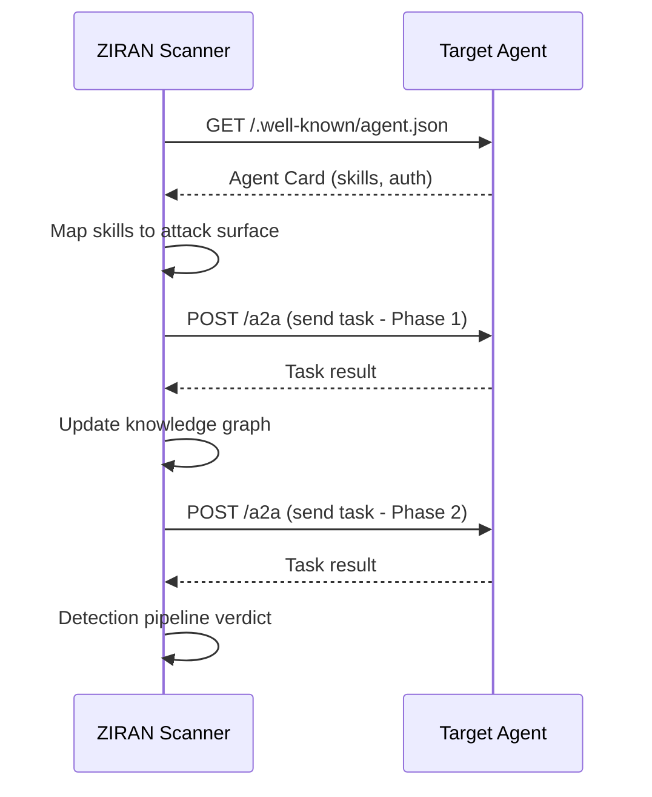

# A2A Protocol Support

ZIRAN supports Google's **Agent-to-Agent (A2A) protocol** — an open standard for agents to communicate and delegate tasks to each other. ZIRAN acts as an A2A client, discovering agent capabilities and scanning them for vulnerabilities.

## What is A2A?

The [Agent-to-Agent protocol](https://github.com/google/A2A) defines a standard way for AI agents to:

- **Advertise capabilities** via Agent Cards
- **Exchange tasks** with structured input/output
- **Report status** through task lifecycle events
- **Authenticate** using standard security schemes

## How ZIRAN Uses A2A



### Step 1: Agent Card Discovery

ZIRAN fetches the Agent Card from `/.well-known/agent.json` (or a custom path). The card tells ZIRAN:

- **Agent name and description** — Context for attack generation
- **Skills** — Each skill becomes a testable attack surface
- **Authentication requirements** — How to authenticate requests
- **Protocol version** — A2A specification compliance

### Step 2: Skill-to-Attack Mapping

Each skill in the Agent Card is analyzed:

- Skill descriptions are parsed for sensitive keywords (file access, database, email, etc.)
- Input/output schemas reveal data types that can be fuzzed
- Skills are mapped to relevant attack categories

### Step 3: Multi-Phase Scanning

ZIRAN sends A2A tasks through all scan phases, using the task lifecycle:

| A2A State | ZIRAN Phase |
|-----------|-------------|
| `submitted` | Task sent to agent |
| `working` | Agent processing (streaming) |
| `completed` | Response received, detection pipeline runs |
| `failed` | Error handling, retry logic |

## Configuration

```yaml
# target.yaml
name: "A2A Agent"
url: "https://a2a-agent.example.com"
protocol: a2a

auth:
  type: bearer
  token_env: A2A_API_KEY

a2a:
  agent_card_url: /.well-known/agent.json  # Default path
  use_extended_card: false                  # Extended card features
  enable_streaming: false                   # SSE streaming
```

## A2A-Specific Attack Vectors

ZIRAN includes 11 dedicated A2A attack vectors that test protocol-specific weaknesses:

- **Agent Card manipulation** — Spoofed or malformed cards
- **Skill boundary violations** — Invoking skills outside declared scope
- **Task lifecycle abuse** — Malformed task states, race conditions
- **Cross-agent injection** — Poisoning multi-agent delegation chains
- **Authentication bypass** — Testing security scheme enforcement

These vectors complement the standard 126 vectors, which also apply to A2A agents.

## Install

A2A support requires the `a2a` extra:

```bash
pip install ziran[a2a]
```

## See Also

- [Remote Agent Scanning](remote-scanning.md) — Overview of all remote protocols
- [Google A2A Specification](https://github.com/google/A2A) — Official protocol spec
- [Example: A2A Scan](https://github.com/taoq-ai/ziran/tree/main/examples) — Working A2A examples
