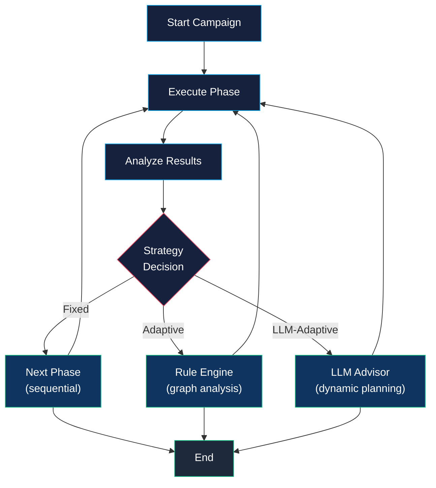

# Adaptive Campaigns

ZIRAN supports three campaign execution strategies that control how scan phases are orchestrated. Choose the strategy that fits your testing scenario.

## Strategies

### Fixed (Default)

Runs phases in their defined sequential order. Simple, predictable, and deterministic.

```bash
ziran scan --target target.yaml --strategy fixed
```

Best for: CI/CD pipelines, reproducible scans, benchmarking.

### Adaptive (Rule-Based)

Analyzes knowledge graph state after each phase and applies rules to decide the next action:

- **Skip phases** that are unlikely to yield findings based on discovered capabilities
- **Re-order phases** to prioritize the most promising attack surface
- **Repeat phases** with adjusted parameters when partial findings suggest deeper vulnerabilities
- **Early termination** when the graph shows the agent is fully hardened

```bash
ziran scan --target target.yaml --strategy adaptive
```

Best for: Thorough manual assessments, complex agents with many capabilities.

### LLM-Adaptive

Uses an LLM to analyze the current knowledge graph, all previous findings, and the agent's capabilities to dynamically plan the next phase. The LLM acts as a strategy advisor — it doesn't execute attacks, it decides *which* attacks to run and in *what order*.

```bash
ziran scan --target target.yaml --strategy llm-adaptive
```

Best for: Maximum coverage on high-value targets, red-team exercises.

!!! note "LLM Required"

    The `llm-adaptive` strategy requires an LLM provider. Set `--llm-provider` and `--llm-model`, or use the `ZIRAN_LLM_PROVIDER` and `ZIRAN_LLM_MODEL` environment variables.

## Comparison

| Aspect | Fixed | Adaptive | LLM-Adaptive |
|--------|-------|----------|-------------|
| Deterministic | Yes | Partially | No |
| LLM required | No | No | Yes |
| Phase ordering | Sequential | Rule-driven | LLM-driven |
| Can skip phases | No | Yes | Yes |
| Can repeat phases | No | Yes | Yes |
| Token cost | None | None | Moderate |
| Best for | CI/CD | Manual assessment | Red-teaming |

## How Adaptive Strategies Work



## Python API

```python
from ziran.application.strategies.adaptive import AdaptiveCampaignStrategy
from ziran.application.strategies.llm_adaptive import LLMAdaptiveCampaignStrategy
from ziran.application.strategies.fixed import FixedCampaignStrategy

# Use directly with the scanner
scanner = AgentScanner(adapter=adapter, attack_library=library)

# Fixed (default)
result = await scanner.run_campaign(strategy=FixedCampaignStrategy())

# Adaptive
result = await scanner.run_campaign(strategy=AdaptiveCampaignStrategy())

# LLM-Adaptive (requires LLM client)
result = await scanner.run_campaign(strategy=LLMAdaptiveCampaignStrategy(llm_client=client))
```

## Custom Strategies

Implement the `CampaignStrategy` protocol to create your own strategy:

```python
from ziran.application.strategies.protocol import CampaignStrategy

class MyStrategy(CampaignStrategy):
    async def select_next_phase(self, context):
        # Your logic here
        ...

    async def should_continue(self, context):
        # Your logic here
        ...
```

## See Also

- [Architecture](architecture.md) — Overall system design
- [Trust Exploitation](romance-scan.md) — The 8-phase methodology
- [CLI Reference](../reference/cli.md) — `--strategy` option documentation
