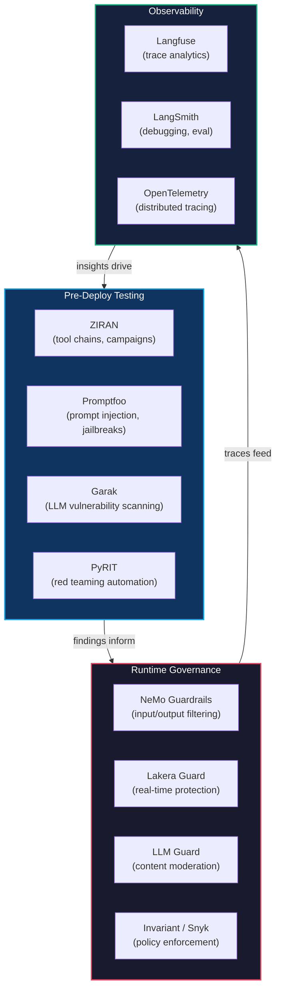

# Agent Security Landscape

AI agent security spans three layers: pre-deployment testing, runtime governance, and observability. Each layer addresses different threats and operates at a different point in the agent lifecycle. ZIRAN focuses on pre-deployment testing -- finding vulnerabilities before agents reach production.

## Three-Layer Security Model

**Pre-deploy testing** discovers vulnerabilities through active probing -- prompt injection, tool chain analysis, multi-phase campaigns, and jailbreak attempts. Findings from this layer inform runtime policies.

**Runtime governance** enforces guardrails in production -- filtering dangerous inputs, blocking unauthorized tool calls, and applying compliance policies. Runtime incidents reveal gaps that pre-deploy testing should cover.

**Observability** captures traces and metrics from live agents. Trace analysis identifies anomalous behavior patterns and feeds those patterns back into pre-deploy test suites.

---

## OWASP LLM Top 10 vs OWASP Agentic Top 10

Two OWASP lists address AI security. The LLM Top 10 targets model-level risks. The Agentic Top 10 targets risks specific to autonomous agents with tools, memory, and multi-step reasoning.

| OWASP LLM Top 10 | OWASP Agentic Top 10 | Relationship |
|---|---|---|
| LLM01: Prompt Injection | AGT01: Excessive Agency | Prompt injection becomes dangerous when the agent has excessive tool access |
| LLM02: Insecure Output Handling | AGT02: Insufficient Access Control | Unvalidated LLM output passed to tools bypasses access controls |
| LLM03: Training Data Poisoning | AGT07: Knowledge Poisoning | Poisoned training data and poisoned knowledge bases share attack patterns |
| LLM04: Model Denial of Service | AGT10: Unmonitored Agentic Behavior | Resource exhaustion attacks exploit lack of monitoring |
| LLM05: Supply Chain Vulnerabilities | AGT08: Supply Chain Vulnerabilities | Both lists recognize third-party dependency risks |
| LLM06: Sensitive Information Disclosure | AGT04: Insufficient Sandboxing | Data leaks through tools in unsandboxed environments |
| LLM07: Insecure Plugin Design | AGT03: Insecure Tool Integration | Insecure plugins are the LLM equivalent of insecure tool integrations |
| LLM08: Excessive Agency | AGT01: Excessive Agency | Direct overlap -- agents amplify excessive agency risk |
| LLM09: Overreliance | AGT09: Human Oversight Bypass | Overreliance leads to reduced human oversight |
| LLM10: Model Theft | AGT05: Improper Multi-Agent Trust | Model theft combined with multi-agent trust enables lateral movement |

ZIRAN covers both lists through its tool chain graph analysis (AGT01, AGT03), side-effect detection (AGT02, AGT04), multi-agent scanning (AGT05), and knowledge graph tracking (AGT07).

---

## Where ZIRAN Fits

ZIRAN operates in the pre-deploy layer, with connections to the other two:

**Pre-deploy (primary):** Graph-based tool chain analysis, multi-phase attack campaigns, autonomous pentesting, side-effect detection.

**Runtime bridge (v0.8):** The `ziran analyze-traces` command pulls production traces from Langfuse and evaluates them against export policies. This bridges the observability layer back into the testing layer. See the [export policy docs](../guides/cicd-integration.md) for configuration.

**Observability integration:** Native OpenTelemetry support (`--otel`) emits traces during scans, making ZIRAN scan results visible in the same dashboards as production agent behavior. See the [OpenTelemetry tracing guide](../guides/otel-tracing.md).

---

## Choosing the Right Tools

| Need | Tools |
|---|---|
| Find tool chain vulnerabilities before deployment | **ZIRAN** |
| Test prompt injection and jailbreak resistance | **Promptfoo** + **ZIRAN** |
| Scan LLM-layer vulnerabilities | **Garak** + **ZIRAN** |
| Block dangerous inputs in production | **NeMo Guardrails** or **Lakera** |
| Enforce runtime compliance policies | **Invariant** (Snyk) |
| Monitor agent behavior in production | **Langfuse** or **LangSmith** |
| Evaluate traces against security policies | **ZIRAN** (`analyze-traces`) |
| Produce tamper-evident audit logs for compliance | **asqav**, signed OTel exporters |

The strongest security posture combines tools from all three layers. Use ZIRAN with Promptfoo for testing breadth, add NeMo Guardrails or Lakera for runtime protection, and connect Langfuse for continuous observability.

---

## Emerging: Compliance Evidence Layer

The three layers above cover discovery, enforcement, and visibility — but none produces tamper-evident proof of what an agent actually did. Regulations like the EU AI Act (Article 12) require auditable records that go beyond observability dashboards.

A compliance evidence layer sits alongside observability and produces cryptographically signed, hash-chained receipts for each tool call. If a receipt is missing or altered, the chain breaks and the omission is detectable. Projects like [asqav](https://github.com/jagmarques/asqav) explore this space using post-quantum signatures (ML-DSA-65) per tool invocation.

ZIRAN does not produce compliance evidence today, but its outputs can feed into such systems: `export-policy` rules define what should be audited, and `analyze-traces` findings flag which production sequences need closer scrutiny. A future integration could attach ZIRAN finding IDs to signed receipts, closing the loop from discovery to evidence.

---

## See Also

- [OWASP Mapping](owasp-mapping.md) -- how ZIRAN maps findings to OWASP categories
- [CI/CD Integration](../guides/cicd-integration.md) -- quality gates and policy enforcement
- [CI Integrations](../guides/ci-integrations.md) -- templates for GitHub Actions, GitLab, Jenkins, CircleCI, Azure
- [OpenTelemetry Tracing](../guides/otel-tracing.md) -- observability integration
