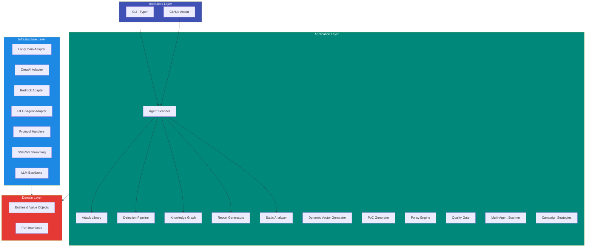

# Architecture

ZIRAN follows **hexagonal architecture** (ports & adapters) with **Domain-Driven Design** principles. This makes it extensible, testable, and framework-agnostic.

## Layer Diagram



## Directory Structure

```
ziran/
├── domain/                     # Core business logic (no dependencies)
│   ├── entities/               # Domain models (Pydantic)
│   │   ├── attack.py           # AttackVector, AttackCategory, OwaspLlmCategory
│   │   ├── campaign.py         # CampaignResult, PhaseResult, AttackResult
│   │   ├── ci.py               # QualityGateConfig, GateResult
│   │   ├── detection.py        # DetectorResult, Verdict
│   │   ├── multi_agent.py      # MultiAgentTopology, AgentNode, AgentEdge
│   │   ├── phase.py            # ScanPhase (8 phases)
│   │   ├── policy.py           # Policy, PolicyRule, PolicyVerdict
│   │   ├── streaming.py        # AgentResponseChunk, LLMResponseChunk
│   │   └── target.py           # TargetConfig, ProtocolType, AuthConfig
│   └── interfaces/             # Port interfaces (ABCs)
│       ├── adapter.py          # AgentAdapter — the core extension point
│       └── detector.py         # BaseDetector
│
├── application/                # Use cases (orchestration)
│   ├── agent_scanner/          # Scanner orchestrator
│   ├── attacks/                # Attack library + 137 YAML vectors
│   ├── detectors/              # 3-detector pipeline
│   ├── knowledge_graph/        # NetworkX graph + chain analyzer
│   ├── reports/                # HTML, Markdown, JSON, SARIF generators
│   ├── static_analysis/        # 10 offline checks (SA001–SA010)
│   ├── dynamic_vectors/        # LLM-powered vector generation
│   ├── poc_generator/          # Exploit PoC generation
│   ├── policy/                 # Policy engine
│   ├── multi_agent/            # Multi-agent topology discovery & scanning
│   ├── strategies/             # Campaign execution strategies (fixed, adaptive, llm-adaptive)
│   └── cicd/                   # Quality gate + SARIF
│
├── infrastructure/             # External integrations
│   └── adapters/
│       ├── langchain_adapter.py
│       ├── crewai_adapter.py
│       ├── bedrock_adapter.py
│       ├── http_agent_adapter.py  # Remote agent scanning
│       └── protocols/             # REST, OpenAI, MCP, A2A, SSE, WebSocket handlers
│   ├── llm/                    # LLM backbone (LiteLLM, streaming)
│   └── logging/                # Structured logging
│
└── interfaces/                 # Entry points
    └── cli/                    # Typer CLI application
```

## Key Design Decisions

### Ports & Adapters

The `AgentAdapter` interface is the main **port** — it defines how ZIRAN interacts with any agent:

```python
class AgentAdapter(ABC):
    @abstractmethod
    async def send_message(self, message: str) -> AgentResponse: ...

    @abstractmethod
    async def get_tools(self) -> list[ToolInfo]: ...

    @abstractmethod
    async def reset_session(self) -> None: ...
```

Framework adapters (LangChain, CrewAI, Bedrock) and the HTTP adapter are **implementations** of this port. Adding a new framework means implementing one class — nothing else changes.

### Domain Independence

The domain layer has **zero external dependencies**. Entities are Pydantic models with no imports from application or infrastructure. This ensures business rules are testable without mocking external systems.

### Knowledge Graph as Shared State

The `AttackKnowledgeGraph` is the **shared state** across all scan phases. Each phase reads and writes to it, enabling:

- Cross-phase attack paths (discovered in Phase 3, exploited in Phase 6)
- Tool chain analysis after all phases complete
- Interactive visualization in reports

## Extension Points

| Extension | Interface | Example |
|-----------|-----------|---------|
| New framework | `AgentAdapter` | Add `my_framework_adapter.py` |
| New detector | `BaseDetector` | Custom detection logic |
| New attack vectors | YAML files | `--custom-attacks ./my_vectors/` |
| New report format | `ReportGenerator` | Custom output format |
| New protocol | `BaseProtocolHandler` | Custom wire protocol |
| Campaign strategy | `CampaignStrategy` | Custom phase orchestration |
| Static analysis check | `CheckDefinition` | New SA0xx check |
| Policy rules | `PolicyRule` | Custom compliance rules |

## Testing

ZIRAN has 840+ tests organized by architecture layer:

```bash
# Run all tests
uv run pytest

# Run by layer
uv run pytest tests/unit/domain/      # Domain tests (fast, no I/O)
uv run pytest tests/unit/application/  # Application tests
uv run pytest tests/unit/infrastructure/ # Adapter tests
uv run pytest tests/integration/       # Integration tests
```
