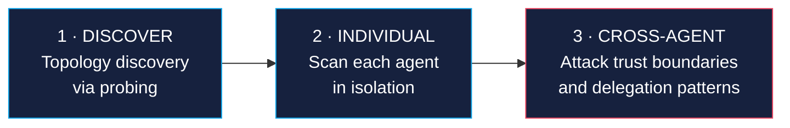

# Multi-Agent Coordination

ZIRAN can discover and test coordinated multi-agent systems — supervisors, routers, peer-to-peer networks, pipelines, and hierarchical architectures.

## Why Multi-Agent Testing Matters

Modern AI systems increasingly use multiple cooperating agents. A supervisor delegates tasks to specialized workers; a router dispatches requests to domain experts; agents pass context to each other through delegation chains. Each inter-agent boundary is a potential attack surface:

- **Trust boundary exploitation** — An attacker who compromises one agent may escalate through delegation chains
- **Cross-agent prompt injection** — Injected content in Agent A's response may be trusted by Agent B
- **Privilege escalation** — A worker agent may have capabilities the supervisor doesn't directly expose
- **Data leakage** — Full-context delegation patterns may forward sensitive information to less-privileged agents

## How It Works

The multi-agent scanner operates in three stages:



### Stage 1: Topology Discovery

ZIRAN probes the entry-point agent with targeted prompts to discover:

- Other agents in the system
- Delegation patterns (full context, task-only, tool calls)
- Trust boundaries (same process, network, cross-organization)
- Agent roles (supervisor, router, worker, specialist)

The discovered topology is classified as one of:

| Type | Description |
|------|-------------|
| **Supervisor** | One orchestrator delegates to multiple workers |
| **Router** | A routing agent dispatches to specialized agents |
| **Peer-to-Peer** | Agents communicate directly with each other |
| **Hierarchical** | Multi-level supervisor hierarchy |
| **Pipeline** | Sequential chain of agents (output → input) |

### Stage 2: Individual Scans

Each agent is scanned in isolation using the standard multi-phase campaign. Results are merged into a shared knowledge graph with agent-prefixed node IDs to avoid collisions.

### Stage 3: Cross-Agent Campaign

Using the entry-point agent, ZIRAN executes attacks that exploit inter-agent communication:

- Prompt injection that propagates through delegation chains
- Trust boundary probing across agent boundaries
- Privilege escalation through capability gaps between agents
- Data exfiltration via cross-agent context leakage

## Usage

### CLI

```bash
# Scan a multi-agent system
ziran multi-agent-scan --target target.yaml

# Comprehensive coverage, 10 concurrent attacks
ziran multi-agent-scan --target target.yaml --coverage comprehensive --concurrency 10

# Skip individual agent scans (cross-agent only)
ziran multi-agent-scan --target target.yaml --skip-individual
```

### Python API

```python
import asyncio
from ziran.application.multi_agent.scanner import MultiAgentScanner

scanner = MultiAgentScanner(
    adapters={"supervisor": sup_adapter, "worker": wrk_adapter},
    entry_point="supervisor",
)

result = asyncio.run(scanner.run_multi_agent_campaign())

print(f"Topology: {result.topology.topology_type}")
print(f"Agents scanned: {result.total_agents}")
print(f"Total vulnerabilities: {result.total_vulnerabilities}")
print(f"Cross-agent vulnerabilities: {result.cross_agent_vulnerabilities}")
```

## Attack Vectors

ZIRAN ships with 327 multi-agent attack vectors in `ziran/application/attacks/vectors/multi_agent.yaml`, covering:

- **Cross-agent prompt injection** — Injected content that propagates through delegation
- **Delegation chain manipulation** — Exploiting trust between supervisor and worker agents
- **Shared memory poisoning** — Corrupting shared state between agents
- **Agent impersonation** — Impersonating other agents in the system
- **Routing bypass** — Redirecting requests to unintended agents

## Knowledge Graph

Discovered topologies are imported into the attack knowledge graph. Each agent becomes a node, each delegation or trust boundary becomes an edge. This enables cross-agent attack path analysis — finding multi-hop exploitation chains that span agent boundaries.

## See Also

- [Architecture](architecture.md) — Overall system design
- [Trust Exploitation](romance-scan.md) — Multi-phase methodology used for individual agent scans
- [Knowledge Graph](knowledge-graph.md) — How the graph tracks cross-agent relationships
