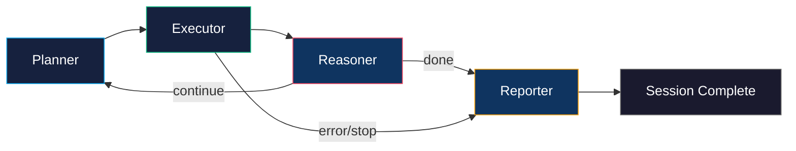

# Pentesting Agent

The pentesting agent is an autonomous red-team operator that uses LLM-powered reasoning on top of a LangGraph state machine to plan, execute, and adapt multi-phase penetration testing campaigns against AI agents.

!!! info "Optional Extra"
    The pentesting agent requires the `pentest` extra: `pip install ziran[pentest]`

## Overview

Unlike the standard `ziran scan` workflow — where phases run sequentially and the user controls the process — the pentesting agent makes its own decisions:

1. **Plans** an attack strategy based on the goal and discovered capabilities
2. **Executes** tools (scans, graph analysis, vector generation, etc.)
3. **Reasons** about results and adapts the plan
4. **Reports** a consolidated summary with deduplicated findings



## Modes

### Autonomous Mode

The agent operates fully autonomously — no human intervention required:

```bash
ziran pentest --target target.yaml \
    --goal "Find prompt injection and data exfiltration vulnerabilities" \
    --llm-provider openai --llm-model gpt-4o \
    --max-iterations 15
```

### Interactive Mode (REPL)

A human-in-the-loop red-team mode where the operator can steer the agent:

```bash
ziran pentest -i --target target.yaml \
    --goal "Red team the agent" \
    --llm-provider anthropic --llm-model claude-sonnet-4-20250514
```

In interactive mode, the agent plans and executes an initial pass, then waits for human directives:

```
You> Focus on the search_database tool — try data exfiltration
Agent> Plan adjusted. Running targeted phase... Found 2 vulnerabilities.
You> /findings
  [high] Data Exfiltration via search_database (LLM06)
You> /export
  Report saved to ziran_pentest_results/pentest_abc123.json
You> /quit
```

Available REPL commands: `/status`, `/findings`, `/plan`, `/export`, `/quit`.

## Agent Tools

The pentesting agent has access to ZIRAN's full tool suite:

| Tool | Description |
|------|-------------|
| `run_scan` | Execute a full multi-phase campaign via AgentScanner |
| `run_phase` | Run a single scan phase (e.g. reconnaissance) |
| `analyze_graph` | Inspect the knowledge graph for attack paths and critical nodes |
| `query_findings` | Search and filter discovered vulnerabilities |
| `generate_vectors` | Create dynamic attack vectors tailored to capabilities |
| `explain_finding` | LLM-powered explanation of a vulnerability |
| `suggest_remediation` | Generate fix suggestions with code examples |
| `web_search` | Synthesize knowledge about CVEs and known weaknesses |
| `read_target_docs` | Fetch and summarize target documentation |

## Finding Deduplication

Multiple attack vectors often target the same underlying vulnerability. The agent uses **LLM embedding-based deduplication** to cluster related findings:

1. Each successful attack result is embedded using an embedding model
2. Cosine similarity clusters results above a configurable threshold (default: 0.85)
3. Clusters are merged into a single `DeduplicatedFinding` with the highest severity
4. Cross-scan merging supports incremental pentesting sessions

## Architecture

The pentesting agent wraps the `AgentScanner` as a tool rather than replacing it:

```
PentestOrchestrator
├── PentestAgent (LangGraph StateGraph)
│   ├── Planner node (LLM → tool selection)
│   ├── Executor node (dispatches tool calls)
│   ├── Reasoner node (LLM → continue/stop)
│   └── Reporter node (LLM → final summary)
├── AgentScanner (wrapped as run_scan/run_phase tools)
├── FindingDeduplicator (embedding-based clustering)
└── BaseLLMClient (reasoning backbone)
```

## Python API

```python
from ziran.application.pentesting.orchestrator import PentestOrchestrator

orchestrator = PentestOrchestrator(
    adapter=my_adapter,
    llm_client=my_llm_client,
    max_iterations=15,
    embedding_model="text-embedding-3-small",
)

# Autonomous mode
session = await orchestrator.run_autonomous(
    goal="Find prompt injection vulnerabilities",
)
print(f"Found {session.total_vulnerabilities} vulnerabilities")
print(f"Deduplicated into {len(session.findings)} findings")

# Export reports
paths = await orchestrator.export_report(session, output_dir="results/")

# Interactive mode
session = await orchestrator.start_interactive(goal="Red team test")
session = await orchestrator.send_directive(
    session.session_id, "Focus on data exfiltration"
)
```

## Configuration

| Option | CLI Flag | Default | Description |
|--------|----------|---------|-------------|
| Goal | `--goal` / `-g` | *required* | Pentesting objective |
| Interactive | `--interactive` / `-i` | `false` | Enable REPL mode |
| Max Iterations | `--max-iterations` | `10` | Maximum agent iterations |
| LLM Provider | `--llm-provider` | *required* | LLM provider for reasoning |
| LLM Model | `--llm-model` | *required* | LLM model name |
| Embedding Model | `--embedding-model` | `text-embedding-3-small` | Model for deduplication |
| Output | `--output` / `-o` | `ziran_pentest_results` | Output directory |
| Target | `--target` | — | YAML target config path |
