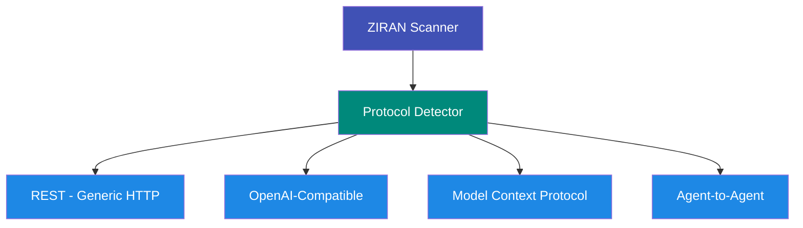

# Remote Agent Scanning

ZIRAN can scan **any AI agent published over HTTPS** — without access to source code. This is critical for testing agents deployed as services, third-party agents, and multi-agent architectures.

!!! success "New in v0.3"

    Remote scanning was introduced in v0.3.0 and supports REST, OpenAI-compatible, MCP, and A2A protocols.

## Why Remote Scanning?

In production, agents are deployed as HTTP endpoints — not as Python objects. Remote scanning lets you:

- **Test deployed agents** exactly as users interact with them
- **Audit third-party agents** without source code access
- **Validate multi-agent systems** end-to-end
- **Integrate with CI/CD** for pre-production security gates

## Supported Protocols



| Protocol | Standard | Best For |
|----------|----------|----------|
| REST | Generic HTTP | Custom APIs, any HTTP endpoint |
| OpenAI | OpenAI Chat Completions API | OpenAI, Azure OpenAI, compatible providers |
| MCP | Model Context Protocol (Anthropic) | MCP-compliant tool servers |
| A2A | Agent-to-Agent (Google) | Google A2A agents with Agent Cards |

## Target Configuration

Remote agents are configured via YAML:

```yaml
# target.yaml
name: "Customer Support Agent"
url: "https://agent.example.com"
protocol: auto  # auto | rest | openai | mcp | a2a

# Authentication
auth:
  type: bearer          # bearer | api_key | basic | oauth2
  token_env: API_KEY    # Read from environment variable

# TLS settings (optional)
tls:
  verify: true
  client_cert: /path/to/cert.pem
  client_key: /path/to/key.pem

# Retry settings (optional)
retry:
  max_retries: 3
  backoff_factor: 0.5
  retry_on: [429, 500, 502, 503, 504]

# Timeout in seconds
timeout: 30

# Custom headers (optional)
headers:
  X-Custom-Header: "value"
```

### Protocol-Specific Config

=== "REST"

    ```yaml
    protocol: rest
    rest:
      method: POST
      request_path: /api/chat
      message_field: message
      response_field: response
      extra_body:
        model: "gpt-4"
    ```

=== "OpenAI"

    ```yaml
    protocol: openai
    # Uses /v1/chat/completions by default
    # Compatible with any OpenAI-API provider
    ```

=== "MCP"

    ```yaml
    protocol: mcp
    # Discovers tools via MCP protocol
    # Tests each tool individually
    ```

=== "A2A"

    ```yaml
    protocol: a2a
    a2a:
      agent_card_url: /.well-known/agent.json
      use_extended_card: false
      enable_streaming: false
    ```

## Auto-Detection

When `protocol: auto`, ZIRAN probes the endpoint to determine the protocol:

1. **A2A** — Fetches `/.well-known/agent.json` for an Agent Card
2. **OpenAI** — Sends a test request to `/v1/chat/completions`
3. **MCP** — Looks for MCP handshake headers
4. **REST** — Falls back to generic HTTP

## Authentication Types

| Type | Fields | Use Case |
|------|--------|----------|
| `bearer` | `token_env` or `token` | API keys as Bearer tokens |
| `api_key` | `token_env`, `header_name` | Custom header API keys |
| `basic` | `username`, `password` | HTTP Basic Auth |
| `oauth2` | `client_id`, `client_secret`, `token_url`, `scopes` | OAuth 2.0 Client Credentials |

!!! warning "Security best practice"

    Always use `token_env` to read secrets from environment variables instead of hardcoding `token` values in YAML files.

## Running a Remote Scan

```bash
# Auto-detect protocol
ziran scan --target target.yaml

# Override protocol
ziran scan --target target.yaml --protocol openai

# With coverage level
ziran scan --target target.yaml --coverage comprehensive
```

## See Also

- [Remote Agent Scanning Guide](../guides/remote-agents.md) — Step-by-step walkthrough
- [A2A Protocol](a2a-protocol.md) — Deep dive into Agent-to-Agent scanning
