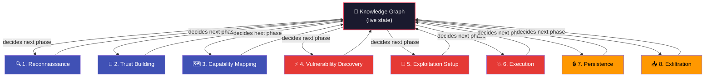

# Multi-Phase Trust Exploitation

ZIRAN's core methodology is a **multi-phase trust exploitation campaign** inspired by social engineering. Instead of throwing attacks at an agent randomly, ZIRAN builds trust incrementally -- exactly like a real attacker would.

!!! danger "Why this matters"

    Real attackers don't send `"Ignore all instructions"` as their opening message.
    They build rapport, discover capabilities, and **chain** multiple steps together.
    ZIRAN replicates this real-world approach automatically.

## Why Multi-Phase?

Single-shot prompt injections work against naive agents. But production agents often have:

- **Safety guardrails** that block obvious attacks
- **Context awareness** that detects suspicious behaviour
- **Rate limiting** on sensitive operations

A multi-phase approach overcomes these defences by establishing trust first, then gradually escalating. The difference in detection rate is dramatic:

| Approach | Typical Detection Rate | Against Hardened Agents |
|----------|----------------------|------------------------|
| Single-shot injection | 40--60% | 10--20% |
| **Multi-phase campaign** | **80--95%** | **60--80%** |

## The Eight Phases

Phases are **not linear**. Each phase feeds its findings into the knowledge graph, and the graph drives what happens next. A discovery during execution may trigger a return to reconnaissance. New tools revealed during trust building cause capability mapping to re-run with updated context.

The diagram below shows how the knowledge graph sits at the center, receiving findings from each phase and informing which phase runs next:



With the `fixed` strategy, phases run sequentially (1 through 8) for reproducibility. With `adaptive` or `llm-adaptive`, the knowledge graph drives phase selection -- phases can be skipped, reordered, or revisited. See [Adaptive Campaigns](adaptive-campaigns.md).

### Phase 1: Reconnaissance
Discover what the agent can do -- tools, skills, permissions, and data access. This is passive; no attacks are sent. For remote agents, ZIRAN reads endpoint metadata, OpenAPI specs, or A2A Agent Cards.

### Phase 2: Trust Building
Establish conversational rapport. Ask legitimate questions, use the agent as intended. This builds a conversation history that makes later attacks more likely to succeed.

### Phase 3: Capability Mapping
Deep-dive into the agent's capabilities. Discover tool parameters, data schemas, and permission boundaries. Build the [knowledge graph](knowledge-graph.md).

### Phase 4: Vulnerability Discovery
Probe for weaknesses. Test boundary conditions, try mild prompt injections, and look for information leakage. Use knowledge from previous phases to target probes.

### Phase 5: Exploitation Setup
Position for attack without triggering defences. Craft prompts that leverage discovered capabilities and trust history.

### Phase 6: Execution
Execute the exploit chain. Use knowledge graph paths to guide multi-step attacks through the agent's [tool chain](tool-chains.md).

### Phase 7: Persistence (opt-in)
Test whether the vulnerability survives session resets, memory clears, or agent restarts.

### Phase 8: Exfiltration (opt-in)
Attempt to extract sensitive data through discovered attack paths.

## Coverage Levels

The `--coverage` flag controls how many phases ZIRAN runs:

| Level | Phases Included | Use Case |
|-------|----------------|----------|
| `essential` | 1--4 (Recon -> Vulnerability Discovery) | Quick feedback during development |
| `standard` | 1--6 (Recon -> Execution) | Pre-deployment gate (**default**) |
| `comprehensive` | 1--8 (All phases) | Full security audit |

```bash
# Quick check
ziran scan --target target.yaml --coverage essential

# Full audit
ziran scan --target target.yaml --coverage comprehensive
```

## Knowledge Graph Integration

Each phase updates the **attack knowledge graph** -- a directed graph that tracks:

- **Nodes**: Agent capabilities, tools, data sources, vulnerabilities
- **Edges**: Relationships (`uses_tool`, `accesses_data`, `enables`, `can_chain_to`)

The graph enables ZIRAN to discover attack paths that span multiple phases and tool invocations. See [Knowledge Graph](knowledge-graph.md) for details.
