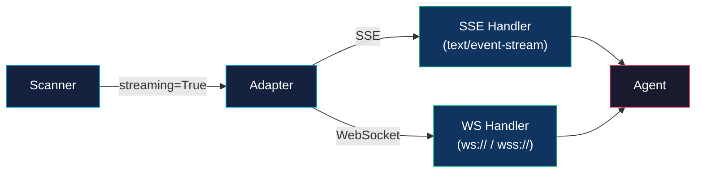

# Streaming Support

ZIRAN supports real-time response monitoring via Server-Sent Events (SSE) and WebSocket protocols. This enables observing agent responses as they stream in, rather than waiting for the full response to complete.

## Why Streaming?

Many modern agents produce long-running responses — multi-step reasoning, tool call chains, or extended text generation. Streaming provides:

- **Real-time monitoring** — See agent responses as they arrive, token by token
- **Early detection** — Identify suspicious content before the response completes
- **Long-running agents** — Avoid timeouts on agents that take minutes to respond
- **Protocol fidelity** — Test agents over the same protocol they use in production

## Supported Protocols

| Protocol | Transport | Use Case |
|----------|-----------|----------|
| **SSE** | HTTP with `text/event-stream` | OpenAI-compatible APIs, most LLM gateways |
| **WebSocket** | Persistent bidirectional connection | Real-time chat agents, interactive sessions |

## Usage

### CLI

```bash
# Enable streaming for a scan
ziran scan --target target.yaml --streaming

# Combine with adaptive strategy
ziran scan --target target.yaml --streaming --strategy adaptive
```

### Python API

```python
from ziran.application.agent_scanner.scanner import AgentScanner

scanner = AgentScanner(adapter=adapter, attack_library=library)
result = await scanner.run_campaign(streaming=True)
```

### Streaming with the Adapter

The adapter layer handles streaming transparently. When streaming is enabled, adapters that support it will use `invoke_streaming()` instead of `invoke()`:

```python
from ziran.domain.interfaces.adapter import BaseAgentAdapter

class MyStreamingAdapter(BaseAgentAdapter):
    async def invoke_streaming(self, prompt: str):
        async for chunk in my_agent.stream(prompt):
            yield AgentResponseChunk(
                content=chunk.text,
                is_final=chunk.is_last,
            )
```

## Architecture



## Domain Entities

### AgentResponseChunk

Each streamed chunk is represented as an `AgentResponseChunk`:

```python
class AgentResponseChunk(BaseModel):
    content: str          # Partial response text
    is_final: bool        # Whether this is the last chunk
    tool_calls: list      # Tool calls discovered in this chunk
    metadata: dict        # Protocol-specific metadata
```

### LLMResponseChunk

For the LLM backbone layer, streaming responses use `LLMResponseChunk`:

```python
class LLMResponseChunk(BaseModel):
    content: str          # Partial LLM output
    is_final: bool        # Last chunk flag
    model: str            # Model that generated this chunk
    usage: dict           # Token usage (available on final chunk)
```

## Installation

Streaming support requires the `streaming` extra:

```bash
pip install ziran[streaming]
```

This installs the `websockets` library for WebSocket support. SSE streaming uses `httpx` which is included in the base installation.

## See Also

- [Remote Scanning](remote-scanning.md) — Protocol configuration for remote agents
- [Architecture](architecture.md) — How streaming fits into the adapter layer
- [CLI Reference](../reference/cli.md) — `--streaming` option documentation
