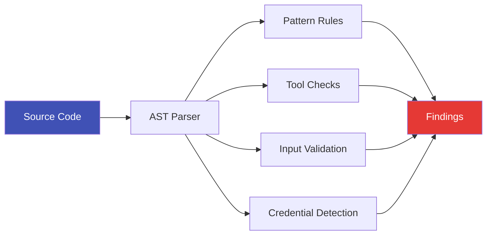

# Static Analysis

ZIRAN includes a **static analysis engine** that checks agent source code for security issues **without running the agent or calling any LLM**. This makes it fast, free, and ideal for early-stage development feedback.

!!! tip "No API key required"

    Static analysis works entirely offline — no LLM calls, no API keys, no network access.

## Quick Start

```bash
# Scan a single file
ziran audit my_agent.py

# Scan a directory
ziran audit ./src/agents/

# Filter by minimum severity
ziran audit ./src/ --severity high
```

## The 10 Checks

| ID | Check | Severity | Description |
|----|-------|----------|-------------|
| SA001 | Secrets in system prompt | Critical | API keys, tokens, or passwords in system instructions |
| SA002 | No input validation | High | User input passed directly to tools without validation |
| SA003 | Dangerous tool permissions | High | Tools with write/execute/delete capabilities |
| SA004 | Overly broad tool access | Medium | Agent has access to more tools than necessary |
| SA005 | Missing rate limiting | Medium | No throttling on tool invocations |
| SA006 | Verbose error messages | Low | Error messages that leak implementation details |
| SA007 | Unrestricted tool list | High | Agent exposes its full tool list to users |
| SA008 | Hard-coded credentials | Critical | Credentials embedded in source code |
| SA009 | SQL injection risk | High | User input flows to SQL queries without parameterization |
| SA010 | PII exposure risk | High | Personal data accessible through agent tools |

## How It Works

The static analyzer uses pattern matching and AST analysis:

1. **Pattern rules** — Regex patterns that match dangerous code constructs
2. **Dangerous tool checks** — Identifies tools with risky capabilities
3. **Input validation checks** — Traces data flow from user input to tool calls
4. **Credential detection** — Scans for hardcoded secrets and API keys



## Example Output

```
$ ziran audit examples/10-vulnerable-agent/

  SA001  critical  Secrets in system prompt
         examples/10-vulnerable-agent/agent.py:15
         System prompt contains what appears to be an API key

  SA003  high      Dangerous tool permissions
         examples/10-vulnerable-agent/agent.py:28
         Tool 'execute_command' has shell execution capability

  SA009  high      SQL injection risk
         examples/10-vulnerable-agent/agent.py:42
         User input flows to sql_query() without parameterization

  Found 3 issues (1 critical, 2 high)
```

## Configuration

Customize static analysis with a YAML config:

```yaml
# static-analysis-config.yaml
checks:
  SA001:
    enabled: true
    severity: critical
  SA004:
    enabled: false          # Disable this check
  SA005:
    enabled: true
    severity: high          # Upgrade from medium

patterns:
  - name: custom_secret_pattern
    regex: "(?i)(secret|password|token)\\s*=\\s*['\"][^'\"]+['\"]"
    severity: critical
    message: "Potential hardcoded secret"

dangerous_tools:
  - name: shell_execute
    risk: critical
  - name: file_delete
    risk: high
```

## Python API

```python
from ziran.application.static_analysis.analyzer import StaticAnalyzer
from ziran.application.static_analysis.config import StaticAnalysisConfig

# Default config
analyzer = StaticAnalyzer()
findings = analyzer.analyze_file("my_agent.py")

for finding in findings:
    print(f"  {finding.check_id}  {finding.severity}  {finding.message}")
    print(f"         {finding.file}:{finding.line}")

# Custom config
config = StaticAnalysisConfig.from_yaml("static-analysis-config.yaml")
analyzer = StaticAnalyzer(config=config)
findings = analyzer.analyze_directory("./src/")
```

## CI/CD Usage

Static analysis is especially valuable in CI because it requires no LLM:

```yaml
# .github/workflows/security.yml
- name: Static analysis
  run: ziran audit ./src/ --severity medium
```

Combine with dynamic scanning for comprehensive coverage:

```yaml
- name: Static analysis (fast, free)
  run: ziran audit ./src/ --severity high

- name: Dynamic scan (thorough, requires API key)
  env:
    OPENAI_API_KEY: ${{ secrets.OPENAI_API_KEY }}
  run: ziran scan --target target.yaml --coverage standard
```

## See Also

- [Architecture](../concepts/architecture.md) — Where static analysis fits
- [CI/CD Integration](cicd-integration.md) — Full pipeline setup
- [Tool Chain Analysis](../concepts/tool-chains.md) — Runtime complement to static checks
